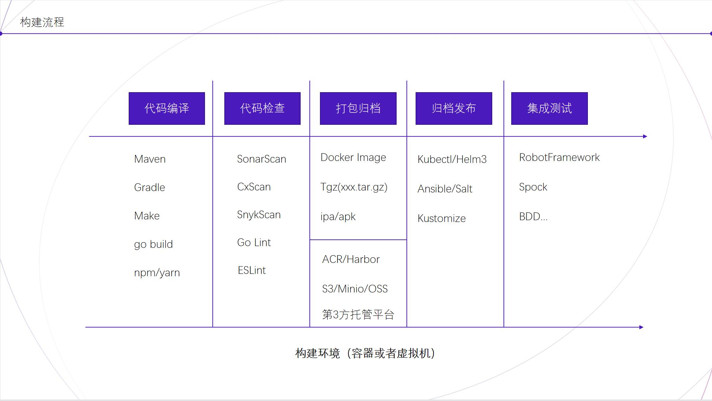
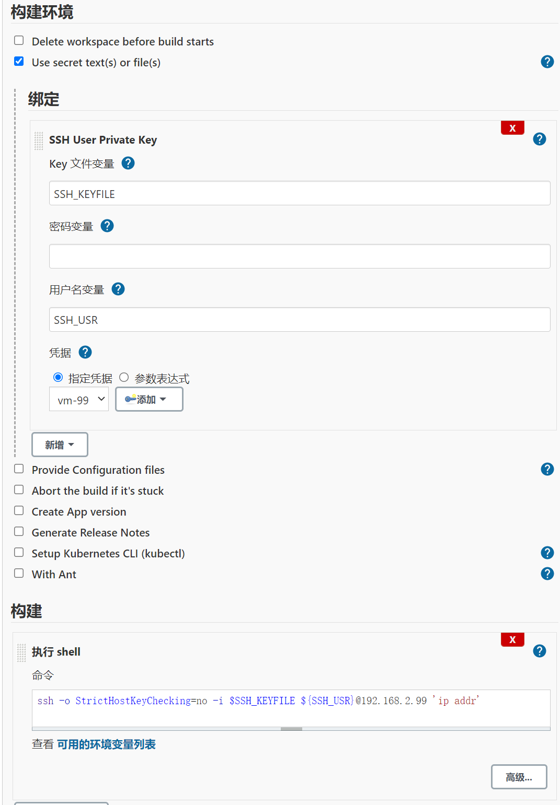

# Jenkins 快速入门和使用技巧

<image src="https://www.jenkins.io/images/logos/jenkins/Jenkins.svg">


## 1. Jenkins 介绍

```markdown 
# 构建伟大，无所不能。

 Jenkins 是开源 CI&CD 软件领导者， 提供超过1000个插件来支持构建、部署、自动化，满足任何项目的需要。

> 出自 [Jenkins 官网](https://www.jenkins.io/zh/)

 ```

### 1.1 历史考古

1. 大约在 2001 年，ThoughtWorks 开源了 CruiseControl（后面出了商业版本叫 Cruise，再后来改名为 GoCD）。
1. 2004 年夏天由 Sun 公司开发的 Hudson ，在 2005 年 2 月开源并发布第一个版本。
1. 大约在 2007 年，Hudson 被称为 Cruise Control 和其他开源构建服务器的更好替代品。
1. 2008 年 5 月的 JavaOne 大会上，Hudson 获得了开发解决方案类的 Duke's Choice 奖项。
1. 大约在 2010 年，甲骨文声称拥有 Hudson 的商标的权利，所以在 2011 年 1 月通过社区投票改名为 Jenkins (事件起因是因为 2009 年 6月 Oracle 收购 Sun)。
1. 2011 年 2 月，Jenkins 的第一个版本 1.396 版可供公众使用。
1. 2015 年 5 月，Jenkins 发布了基于 Java 7 的 1.612 版本。
1. 2016 年 4 月，Jenkins 发布了 2.0 版本。
1. 2017 年 4 月，Jenkins 发布了基于 Java 8 的 2.54 版本。
1. 2019 年 2 月，Jenkins 发布了基于 Java 8 和 Java 11的 2.164 版本。
1. 2022 年 5 月，截至目前最新版本 Jenkins 2.347 Weekly 和 Jenkins 2.332.3 LTS

资料链接

* https://martinfowler.com/articles/continuousIntegration.html
* http://cruisecontrol.sourceforge.net/download.html
* https://en.wikipedia.org/wiki/Jenkins_(software)
* https://www.jenkins.io/blog/2012/02/02/happy-birthday-jenkins/
* https://www.jenkins.io/2.0/
* https://www.jenkins.io/blog/2017/04/10/jenkins-has-upgraded-to-java-8/
* https://www.jenkins.io/download/
* https://www.jenkins.io/blog/2011/06/16/jenkins-long-term-support-release/
* https://www.jenkins.io/blog/2012/03/13/why-does-jenkins-have-blue-balls/
* https://www.jenkins.io/blog/2017/01/17/Jenkins-is-upgrading-to-Java-8/

### 1.3 相关工具对比

* https://en.wikipedia.org/wiki/Comparison_of_continuous_integration_software
* https://github.blog/2017-11-07-github-welcomes-all-ci-tools/


### 1.4 推荐学习文档

* https://www.jenkins.io/doc/book/pipeline/
* https://www.bilibili.com/video/BV1fp4y1r7Dd
* https://github.com/cloudbees/groovy-cps/blob/master/doc/cps-model.md
* https://github.com/cloudbees/groovy-cps/blob/master/doc/cps-basics.md

## 2. 环境安装

本教程推荐使用 `docker` 在 Rocky Linux 8上安装 Jenkins 。

> 备注：任何安装有 `docker` 工具的环境都可以。

测试环境服务器信息：

* 本地 Rocky Linux 8 虚拟机，配置 4C16G 40G(sys) 100G(data)
* IP：192.168.2.220

### 2.1 搭建原理

借助 docker 启动 Jenkins 简化服务部署，通过 Swarm 实现 Agent 节点的自动注册。其中 **Swarm** 是一个 **Jenkins** 插件，它允许节点加入附近的 **Jenkins**，从而形成一个特别的集群。通过这个插件我们可以自动向 **Jenkins** 添加 **Agent** 节点，而不用先在 **Jenkins** 上手动创建节点和注册，这个是一个不错的想法。

### 2.2 初始环境

在执行下面的步骤之前需要先完成节点的初始化，比如：关闭防火墙，性能调优配置(sysctl/ulimit)等

1. 安装 docker/docker-compose 工具

运行下面的命令：
```bash
yum install -y yum-utils
yum-config-manager \
    --add-repo \
    https://download.docker.com/linux/centos/docker-ce.repo

# 注意命令 docker-compose 已经作为 docker 插件，使用时需要将 docker-compose 改成 docker compose
yum install -y docker-ce docker-ce-cli containerd.io docker-compose-plugin

mkdir -p /etc/docker
# 配置 docker ，让数据放在数据盘目录，比如：/data
cat << EOF > /etc/docker/daemon.json
{
  "bip":"192.168.101.1/24",
  "data-root":"/data/var/lib/docker/",
  "log-driver": "json-file",
  "log-opts": {
    "max-size": "10m",
    "max-file": "3"

  },
  "exec-opts": ["native.cgroupdriver=systemd"],
  "default-ulimits": {
    "nofile": {
      "Name": "nofile",
      "Hard": 64000,
      "Soft": 64000
    }
  },
  "storage-driver": "overlay2",
  "storage-opts": [
    "overlay2.override_kernel_check=true"
  ],
  "registry-mirrors": ["https://docker.mirrors.ustc.edu.cn"]
}
EOF
# 注意：
# 1. 在EOF后面输入一个回车键，并且里面的网段可以自己指定，切记不好和主机所在网段冲突。
# 2. 需要将本文档同级目录下文件 sysctl.conf 的内容放到本次演示环境的 /etc/sysctl.conf 中，然后执行 sysctl -p 让其配置生效。

systemctl stop firewalld
systemctl disable firewalld

systemctl restart docker
systemctl status docker
systemctl enable docker
```
上面的命令执行完成，正常情况会出现如下图：


> 注：其他发行版本的搭建方式请参见：https://docs.docker.com/engine/install/

### 2.3 启动服务

1. 创建目录、导入启动文件、启动服务、观察日志

```bash
alias docker-compose='docker compose'
# 创建系统目录和数据目录
mkdir -p /data/opsbox-dev/{system,data}/jenkins/
# 设置数据目录权限，因为会将容器数据映射到主机
chown -R 1000:1000 /data/opsbox-dev/data/jenkins

cd /data/opsbox-dev/system/jenkins
cat << EOF > docker-compose.yml
version: '3'
services:
  jenkins-master:
    container_name: jenkins
    image: registry.jihulab.com/opsbox-dev/oes-jenkins-plus:jenkins-v0.1.1-2.319.1-SNAPSHOT
    restart: unless-stopped
    ports:
      - 30080:8080
      - 50000:50000
    volumes:
      - /data/opsbox-dev/data/jenkins:/var/jenkins_home
    environment:
      JAVA_OPTS: >-
        -server
        -Xmx2g -Xms1g
        -XX:+UnlockExperimentalVMOptions -XX:+UseContainerSupport
        -XX:+UseParallelGC -XX:ParallelGCThreads=20 -XX:+UseParallelOldGC
        -XX:MaxGCPauseMillis=100 -XX:+UseAdaptiveSizePolicy
        -Dfile.encoding=UTF-8 -Dsun.jnu.encoding=UTF-8
        -Djenkins.install.runSetupWizard=false
        -Dhudson.model.LoadStatistics.clock=2000
        -Dhudson.model.ParametersAction.keepUndefinedParameters=true
        -Dorg.apache.commons.jelly.tags.fmt.timeZone=Asia/Shanghai
        -Duser.timezone=Asia/Shanghai
        -Dcom.sun.jndi.ldap.connect.pool.timeout=300000
        -Dhudson.security.csrf.DefaultCrumbIssuer.EXCLUDE_SESSION_ID=true

  jenkins-swarm:
    image: registry.jihulab.com/opsbox-dev/oes-jenkins-plus:jenkins-swarm
    restart: unless-stopped
    privileged: true
    volumes:
      - /tmp:/tmp
      - /lib/modules:/lib/modules # 好奇怪的配置在 rockylinux8，如果没有在执行 iptable 时会报异常
    depends_on:
      - jenkins-master
    links:
      - jenkins-master
    environment:
      JENKINS_URL: http://jenkins-master:8080
      JENKINS_USR: admin
      JENKINS_PSW: jenkins
      LABELS: docker

EOF
# 注意这里要给一个回车键

# 拉取镜像
docker-compose pull
# 启动服务
docker-compose up -d 
# 检查服务
docker-compose ps
# 查看日志
docker-compose logs -f
```

> 注：里面使用到的镜像打包源码地址：https://github.com/opsbox-dev/oes-jenkins-plus

启动日志效果如下图：


2. 打开浏览器访问 http://192.168.2.220:30080 

> 账号：*admin* 密码：*jenkins*

### 2.4 测试环境

创建一个任务测试环境，主要是确保 docker 服务可用。


## 3. 基础概念

### 3.1 流程和工具

大师 **Martin Fowler** 对持续集成是这样定义的：持续集成是一种软件开发实践，即团队开发成员经常**集成他们的工作**，通常每个成员每天至少集成一次，也就意味着每天可能会发生多次集成。每次集成都通过自动化的构建（包括**编译，发布，自动化测试**）来验证，从而尽快地发现集成错误。许多团队发现这个过程可以大大减少集成的问题，让团队能够更快的开发内聚的软件。

软件开发和交付过程，开发人员会在不同阶段持续使用如下面图中的工具在实现构建、打包、归档、部署和测试，执行完一次就算一次交付。



> 注：上图整理了我目前在 CI/CD 工作中用的最多的工具，大家可以根据自己的情况整理出自己的技术栈和相关工具。

### 3.2 自由风格工程 和 Pipeline 工程的对比

#### 1. 自由风格工程特点

配置页面分为 6 个区域，包括：工程信息、源码管理、构建触发器、构建环境、构建步骤和构建后动作。配置界面如下图：


#### 2. Pipeline 工程的特点

配置界面分为 4 个区域，包括：工程信息、构建触发器和流水线配置。配置界面如下图：


#### 3. 两种风格对比演示

自由风格配置界面



采用流水线风格描述

```groovy
pipeline {
    agent any

    stages {
        stage('Hello') {
            environment {
                // 目前 credentials 支持 Secret Text/Secret File/Username and password/SSH with Private Key等 4 种类型。
                SSHKEY = credentials('vm-220') 
            }
            steps {
                echo 'Hello Jenkins'

                // 打印当前 Jenkins Agent 的 IP，在 Jenkins Swarm Agent 容器里面。
                sh "ip addr"
                
                // 打印 192.168.2.220 节点 IP 信息
                sh "ssh -o StrictHostKeyChecking=no -i ${SSHKEY} ${SSHKEY_USR}@192.168.2.220 'ip addr'"
               
            }
        }
    }
}

```

> 注：执行需要创建登录 192.168.2.220 的密钥，并将私钥录入 Jenkins 的 Credentials 中。

相关文档链接：
* https://www.jenkins.io/doc/pipeline/steps/credentials-binding/
* https://www.jenkins.io/doc/book/pipeline/syntax/

### 3.3 Jenkins 2.0 中核心的 Jenkinsfile 两种语法背后的历史和原理

#### 1. Jenkins 2.0 历史

历史回顾：

1. 2014 年 5 月，groovy-cps 库诞生了 0.1 版本。
2. 2016 年 4 月，Jenkins 发布了 2.0 版本，对应的 groovy-cps-1.7。
4. 2016 年 8 月，Jenkins 的 pipeline-model-definition 插件发布 0.1 版本。
5. 2017 年 2 月，Jenkins 的 pipeline-model-definition 插件发布 1.0 GA 版本。
6. 2017 年 4 月，Blue Ocean 1.0
7. 2017 年 4 月，Jenkins 发布了基于 Java 8 的 2.54 版本，对应的 pipeline-model-definition-1.1.1。

#### 2. Scripted Pipeline 特点和原理

**特点**

Scripted Pipeline 支持更多的 Groovy 语言语法，不像 Declarative Pipeline 受那么多的结构化限制。由于可以编写灵活的逻辑，可以认为是高级版的 pipeline。

如果打算实现的逻辑比较灵活，比如有判断、分支，或者需要用 Groovy 语言编写复杂的运行步骤，都应该选择使用 Scripted Pipeline。

**原理**

所有的开始都是起源于 KK 的一个叫 groovy-cps 项目。

CPS(Continuation-Passing-Style, 续体传递风格)是一种编程风格：所有的控制块都通过 continuation 来显式传递。在 CPS 风格中，函数不能有返回语句，它的调用者要想获得它的结果，需要显式传递一个回调函数来获取结果并继续执行。而为了保证整个程序执行下去，这个回调函数还会一直嵌套下去。这里的回调函数就是一个 continuation 。

使用 CPS 来实现 Jenkins Pipeline 的原因是期望在任何时候都可以中断代码的执行保存状态，并在适当时候恢复执行。这可以应对 Jenkins Agent 宕机的场景。如果一个函数执行过后就返回了，那么就会丢失一部分状态，CPS 代码由于在中间不返回结果，因此可以解决这个问题。

然而，编写 Pipeline 代码的 Groovy 语言，其本身并不是 CPS 风格的，这就需要一个解释器将代码编译成 CPS 风格，在 Jenkins 里面通过 workflow-cps-plugin 包装 groovy-cps 这个库来完成。

在 workflow-cps-plugin 插件中，将 Job 配置的 Jenkinsfile 解析转为为 `CpsScript` 对象，并借助 Groovy 强大的 DSL (领域特定语言) 能力，实现对特点关键的解析。


举个栗子：

```groovy
node {
    def mvnHome = tool 'M3'

    stage('Checkout') {
        checkout scm
    }

    stage('Build') {
        sh "${mvnHome}/bin/mvn -B package"
    }
}

```
> 代码来源：https://github.com/cloudogu/jenkinsfiles/blob/1-scripted/Jenkinsfile


参考链接：

* https://docs.groovy-lang.org/3.0.7/html/gapi/index.html?groovy/lang/Script.html
* https://github.com/cloudbees/groovy-cps/blob/master/doc/cps-basics.md
* https://github.com/cloudbees/groovy-cps
* https://github.com/jenkinsci/workflow-cps-plugin
* https://github.com/jenkinsci/pipeline-stage-step-plugin
* https://github.com/cloudogu/jenkinsfiles
* https://www.jenkins.io/blog/2016/09/06/jenkins-world-speaker-blog-pipeline-model-definition/
* https://www.jenkins.io/blog/2016/12/19/declarative-pipeline-beta/
* https://www.jenkins.io/blog/2017/02/03/declarative-pipeline-ga/
* https://www.jenkins.io/blog/2017/02/15/declarative-notifications/
* https://www.jenkins.io/blog/2017/04/05/say-hello-blueocean-1-0/
* https://www.jenkins.io/blog/2017/04/10/jenkins-has-upgraded-to-java-8/
* https://www.jenkins.io/blog/2014/07/08/workflow-plugin-tutorial-writing-a-step-impl/


#### 3. Declarative Pipeline 特点和原理

**特点**

Declarative Pipeline 设计意图是使用户将所需要的 Pipeline 以各种维度的参数声明出来，而不是编程的方式描述出来。相对 Scripted Pipeline 语法前者更简单， 但是 Declarative Pipeline 缺少灵活性，所以 Scripted Pipeline 中使用的部分语法在 Declarative Pipeline 中都不能直接使用，但是可以通过在 Declarative Pipeline 中使用 `script` Step 来支持。

Declarative Pipeline 的特点是结构化的声明语句，各模块的从属关系比较固定，类似填写 Jenkins 配置 Job 页面的表单。固定格式的声明语句，还有利于从 BlueOcean 中查看工作流。

**原理**

Declarative Pipeline 是在 Scripted Pipeline 基础上开发，通过实现 `pipeline` 块（block）的语法，以此实现配置风格的流水线描述方式。所以在开发 Declarative Pipeline 时可以在 `pipeline` 块之外可以写 Groovy Scripts。

语法结构

```groovy

pipeline {
    // 运行的节点
    agent {}

    // 全局预设环境变量，包括 Credentinal 变量
    envrionment {}

    // 触发器
    triggers {}

    // 外部库
    libraries {}

    // 特效配置
    options {
        //打开控制台日志的时间戳
        timestamps() 
        // 指定失败后的重试次数
        retry(3) 
        // 指定启动前等待的秒数
        quietPeriod(30)
        // 指定任务的超时时间，超时将放弃该任务
        timeout(time: 1, unit: 'HOURS') 
    }

    // 构建参数
    parameters {}

    // 载入工具
    tools {}

    // 构建任务编排
    stages {
        stage {
            agent {}
            environment {}
            tools {}
            input {}
            when {}
            steps {
                sh ""
                echo ""
                script {
                    //...
                }
                withEnv {

                }
            }
            // 并行任务编排
            parallel {}
        }
        // other stages
    }

    // 构建后处理
    post {

    }
}

```

参考链接

* https://github.com/jenkinsci/pipeline-model-definition-plugin
* https://github.com/jenkinsci/pipeline-model-definition-plugin/blob/master/EXTENDING.md

#### 4. Jenkinsfile 几种扩展方式

1. 直接在 Jenkinsfile 中开发功能函数

```groovy
pipeline {

  agent any

  options {    
    disableConcurrentBuilds()
    skipDefaultCheckout true
  }

  stages{

      stage("Checkout Code") {
        steps {
          script {
            deleteDir()
            cleanWs()
            def branch = purgeBranchString(git.branch)
            git branch: "${branch}", credentialsId: "${git.auth}", url: "${git.url}"
          }
        }
      }
  }
}

def purgeBranchString(branch) {

  def gitBranch = branch

    if (gitBranch?.startsWith("refs/heads/")) {
        gitBranch = gitBranch.replace("refs/heads/", "")
    }

    if (gitBranch?.startsWith("refs/tags/")) {
        gitBranch = gitBranch.replace("refs/tags/", "")
    }

    return gitBranch
}


```

2. 通过外部共享库扩展

* https://github.com/SAP/jenkins-library/tree/0.1

3. 通过开发插件，这里面又有两种，一种是兼容自由风格的，一种是直接继承 `Step` 类来实现的。 

* https://github.com/jenkinsci/pipeline-utility-steps-plugin
* https://github.com/opsbox-dev/oes-pipeline-plugin

## 4. 实战练习
 
 >两三句话的简介？
 
* https://github.com/seanly/cloudogu-jenkinsfiles
