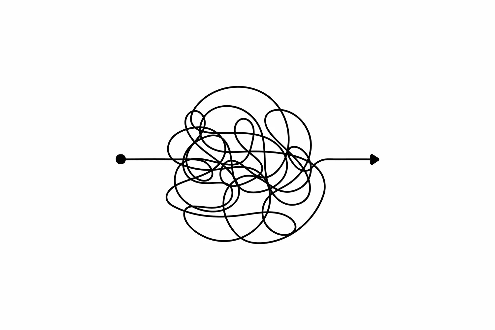

# 云原生 CI/CD Tekton


tektōn 在古希腊语中有工匠、手艺人的意思，比如木匠、石匠、建筑工人。

## Tekton 介绍

Tekton 是 Google 开源的 Kubernetes 原生 CI/CD 系统，功能强大扩展性强。前身是 Knavite 里的 build-pipeline 项目，后期孵化成独立的项目。并成为 CDF 下的四大初始项目之一，其他三个是 Jenkins, Jenkins X, Spinnaker。

### 优势

* 可定制
* 可重用
* 可扩展
* 标准化
* 可伸缩

### 概念

* Step
* Task
* Pipeline
* TaskRun
* PipelineRun


### CRD

为什么说 Tekton 是 Kubernetes 原生的，因为其基于 Kubernetes 的 CRD 定义了 Pipeline 流水线。

* [`Tasks`](https://github.com/tektoncd/pipeline/blob/main/docs/tasks.md)
* [`Pipeline`](https://github.com/tektoncd/pipeline/blob/main/docs/pipelines.md)
* [`TaskRun`](https://github.com/tektoncd/pipeline/blob/main/docs/taskruns.md)
* [`PipelineRun`](https://github.com/tektoncd/pipeline/blob/main/docs/pipelineruns.md)

### Tekton CRD VS Native Resource


## 工作原理

从 PipelineRun 到 TaskRun 再到 Pod 和容器。


详细分析见[Tekton 的工作原理](https://atbug.com/how-tekton-works/)

## Tekton 生态

### 组件

Tekton 包含了多个组件：

* [Tekton Pipelines](https://github.com/tektoncd/pipeline/blob/main/docs/README.md)
* [Tekton Triggers](https://github.com/tektoncd/triggers/blob/main/README.md)
* [Tekton CLI](https://github.com/tektoncd/cli/blob/main/README.md)
* [Tekton Dashboard](https://github.com/tektoncd/dashboard/blob/main/README.md)
* [Tekton Catalog](https://github.com/tektoncd/catalog/blob/v1beta1/README.md)
* [Tekton Hub](https://github.com/tektoncd/hub/blob/main/README.md)
* [Tekton Operator](https://github.com/tektoncd/operator/blob/main/README.md)

## Demo

### 安装集群

```shell
export INSTALL_K3S_VERSION=v1.21.13+k3s1
curl -sfL https://get.k3s.io | sh -s - --disable traefik --write-kubeconfig-mode 644 --write-kubeconfig ~/.kube/config
```

### 安装 Tekton Pipeline

```shell
kubectl apply --filename \
https://storage.googleapis.com/tekton-releases/pipeline/latest/release.yaml
```

检查 CRD

```shell
kubectl api-resources --api-group=tekton.dev
NAME                SHORTNAMES   APIVERSION            NAMESPACED   KIND
clustertasks                     tekton.dev/v1beta1    false        ClusterTask
conditions                       tekton.dev/v1alpha1   true         Condition
pipelineresources                tekton.dev/v1alpha1   true         PipelineResource
pipelineruns        pr,prs       tekton.dev/v1beta1    true         PipelineRun
pipelines                        tekton.dev/v1beta1    true         Pipeline
runs                             tekton.dev/v1alpha1   true         Run
taskruns            tr,trs       tekton.dev/v1beta1    true         TaskRun
tasks                            tekton.dev/v1beta1    true         Task
```

检查组件运行

```shell
kubectl get po -n tekton-pipelines
NAME                                           READY   STATUS    RESTARTS   AGE
tekton-pipelines-controller-5cfb9b8cfc-q4crs   1/1     Running   0          24s
tekton-pipelines-webhook-6c9d4d5798-7xg8n      1/1     Running   0          24s
```

### Hello, Tekton

创建 Task

```shell
kubectl apply -f - <<EOF
apiVersion: tekton.dev/v1beta1
kind: Task
metadata:
  name: hello-tekton
spec:
  steps:
    - name: echo
      image: alpine
      script: |
        #!/bin/sh
        echo "Hello, Tekton"   
EOF
```

运行

```shell
kubectl apply -f - <<EOF
apiVersion: tekton.dev/v1beta1
kind: TaskRun
metadata:
  name: hello-tekton-task-run
spec:
  taskRef:
    name: hello-tekton
EOF
```

### CI/CD 流程

有向无环图（DaG）




我们使用Spring Initializer生成的项目为例, 演示如何使用 Tekton 实现 CICD.

开始之前简单整理下这个项目的 CICD 流程:

1. 拉取代码
2. maven 打包
3. 构建镜像并推送
4. 部署

#### 0x01 RBAC

用于 PipelineRun 运行的 service account。

```shell
kubectl apply -f - <<EOF
apiVersion: v1
kind: ServiceAccount
metadata:
  name: tekton-build

---
apiVersion: rbac.authorization.k8s.io/v1
kind: ClusterRoleBinding
metadata:
  name: pipeline-admin-binding
roleRef:
  apiGroup: rbac.authorization.k8s.io
  kind: ClusterRole
  name: admin # user cluster role admin
subjects:
- kind: ServiceAccount
  name: tekton-build
  namespace: tekton-pipelines
EOF
```

#### 0x02 克隆代码

```shell
kubectl apply -f https://raw.githubusercontent.com/tektoncd/catalog/main/task/git-clone/0.4/git-clone.yaml
```

或者

```shell
tkn hub install task git-clone
```

#### 0x03 maven 打包

```yaml
spec:
  steps:
    - name: maven
      image: maven:3.5-jdk-8-alpine
      imagePullPolicy: IfNotPresent
      workingDir: $(workspaces.source.path)
      command:
        - mvn
      args:
        - clean
        - install
        - -DskipTests
      volumeMounts:
        - name: m2
          mountPath: /root/.m2
  volumes:
    - name: m2
      hostPath:
        path: /data/.m2        
```

#### 0x04 构建并推送镜像

推送镜像到 Docker Hub，需要相关的登录凭证。

kaniko 需要将 docker config 的文件存在于 /kanika/.docker 目录下。这里的思路是将 docker 的 config.json，以 secret 的方式持久化，在通过先添加 docker-registry类型的 secret，然后通过 workspace 的方式输入到 kaniko 运行环境中。

```shell
kubectl create secret docker-registry dockerhub --docker-server=https://index.docker.io/v1/ --docker-username=[USERNAME] --docker-password=[PASSWORD] --dry-run=client -o json | jq -r '.data.".dockerconfigjson"' | base64 -d > /tmp/config.json && kubectl create secret generic docker-config --from-file=/tmp/config.json && rm -f /tmp/config.json
```

构建镜像需要指定资源，比如 Dockerfile 的路径、镜像 URL、tag 等，通过 `params` 输入。

```yaml
spec:
  params:
    - name: pathToDockerFile
      description: The path to the dockerfile to build (relative to the context)
      default: Dockerfile
    - name: imageUrl
      description: Url of image repository
    - name: imageTag
      description: Tag to apply to the built image
      default: latest
    - name: IMAGE
      description: Name (reference) of the image to build.  
  steps:
    - name: build-and-push
      image: gcr.io/kaniko-project/executor:v1.6.0-debug
      imagePullPolicy: IfNotPresent
      command:
        - /kaniko/executor
      args:
        - --dockerfile=$(params.pathToDockerFile)
        - --destination=$(params.imageUrl):$(params.imageTag)
        - --context=$(workspaces.source.path)
        - --digest-file=$(results.IMAGE_DIGEST.path)
```

#### 0x05 部署

```yaml
spec:
  params:
    - name: pathToYamlFile
      description: The path to the yaml file to deploy within the git source
      default: deployment.yaml
  workspaces:
    - name: source
  steps:
    - name: run-kubectl
      image: lachlanevenson/k8s-kubectl:v1.21.11
      imagePullPolicy: IfNotPresent
      command: ["kubectl"]
      args:
        - "apply"
        - "-f"
        - "$(workspaces.source.path)/$(params.pathToYamlFile)"
```

#### 0x06 组装流水线

```yaml
apiVersion: tekton.dev/v1beta1
kind: Pipeline
metadata:
  name: build-pipeline
spec:
  params:
    - name: git-url
    - name: git-revision
    - name: pathToContext
      description: The path to the build context, used by Kaniko - within the workspace
      default: .
    - name: imageUrl
      description: Url of image repository
    - name: imageTag
      description: Tag to apply to the built image
  workspaces:
    - name: git-source
    - name: docker-config
  tasks:
    - name: fetch-from-git
      taskRef:
        name: git-clone
      params:
        - name: url
          value: "$(params.git-url)"
        - name: revision
          value: "$(params.git-revision)"
      workspaces:
        - name: output
          workspace: git-source
    - name: source-to-image
      taskRef:
        name: source-to-image
      params:
        - name: imageUrl
          value: "$(params.imageUrl)"
        - name: IMAGE  
          value: "$(params.imageUrl)"
        - name: imageTag
          value: "$(params.imageTag)"

      workspaces:
        - name: source
          workspace: git-source
        - name: dockerconfig
          workspace: docker-config
      runAfter:
        - fetch-from-git
    - name: deploy-to-k8s
      taskRef: 
        name: deploy-to-k8s
      params:
        - name: pathToYamlFile
          value: deployment.yaml
      workspaces:
        - name: source
          workspace: git-source
      runAfter:
        - source-to-image
```