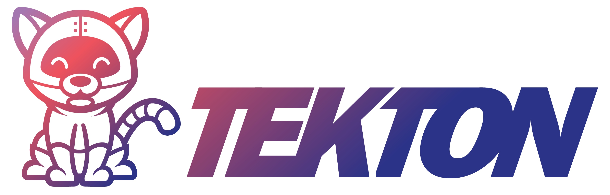
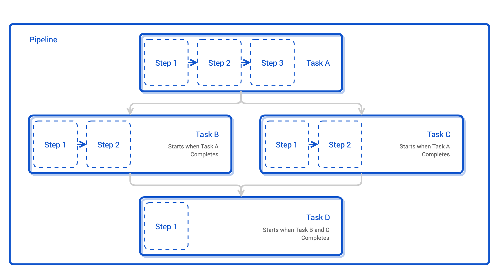
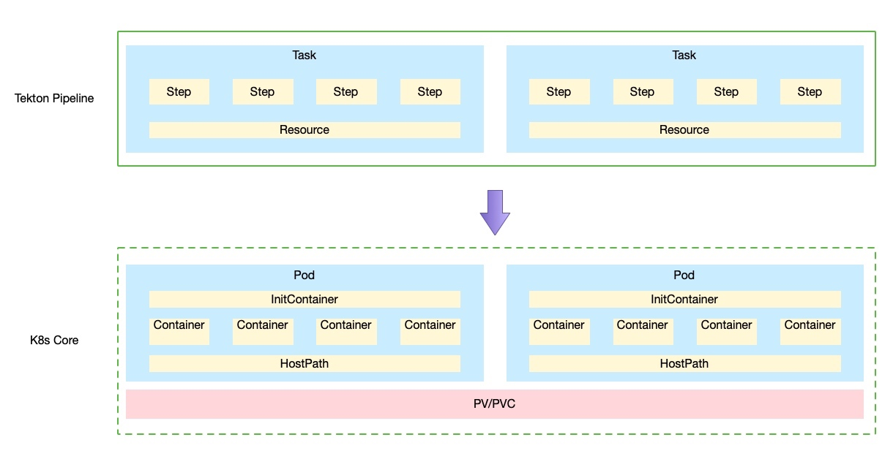
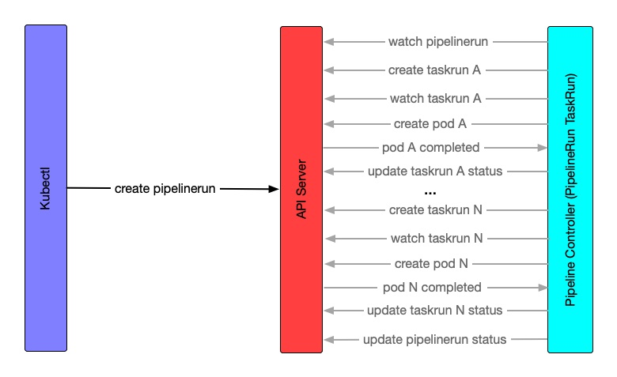

# 云原生 CI/CD Tekton



tektōn 在古希腊语中有工匠、手艺人的意思，比如木匠、石匠、建筑工人。

## Tekton 介绍

Tekton 是 Google 开源的 Kubernetes 原生 CI/CD 系统，功能强大扩展性强。前身是 Knative 里的 build-pipeline 项目，后期孵化成独立的项目。并成为 CDF 下的四大初始项目之一，其他三个是 Jenkins, Jenkins X, Spinnaker。

### 优势

* 可定制
* 可重用
* 可扩展
* 标准化
* 可伸缩

### 概念

* `Step`：CI/CD 工作流中的一个操作，比如编译 Java 程序、运行单元测试等等。
* `Task`：有序 Step 的集合。Tekton 在 Kubernetes 的 Pod 中运行 `Task`，每个 `Step` 则对应 Pod 中的容器。如何 Pod 中的容器可以共享环境一样，`Task` 中的 `Step` 也可以彼此间共享数据。比如在 Pod 中挂在一个卷，各个容器都可以访问卷中的内容。
* `Pipeline`：一些列有序 `Task` 的集合。Tekton 将 `Task` 组合成有序无环图（DAG），并按顺序执行。体现在 Kubernetes 中，Tekton 会按顺序依次创建 Pod 来执行 `Task`，并最终完成整个流水线的执行。
* `PipelineRun`：Pipeline 承载流水线的定义，实际每次运行时都需要创建一个 `PipelineRun` 资源，指定要执行的流水线及其所需的入参。
* `TaskRun`：是 `Task` 的执行。




### CRD

为什么说 Tekton 是 Kubernetes 原生的，因为其基于 Kubernetes 的 CRD 定义了 Pipeline 流水线。

* [`Tasks`](https://github.com/tektoncd/pipeline/blob/main/docs/tasks.md)
* [`Pipeline`](https://github.com/tektoncd/pipeline/blob/main/docs/pipelines.md)
* [`TaskRun`](https://github.com/tektoncd/pipeline/blob/main/docs/taskruns.md)
* [`PipelineRun`](https://github.com/tektoncd/pipeline/blob/main/docs/pipelineruns.md)

### Tekton CRD VS Native Resource



## 工作原理

从 `PipelineRun` 到 `TaskRun` 再到 Pod 和容器。




详细分析见[Tekton 的工作原理](https://atbug.com/how-tekton-works/)

## Tekton 生态

### 组件

Tekton 包含了多个组件：

* [Tekton Pipelines](https://github.com/tektoncd/pipeline/blob/main/docs/README.md)
* [Tekton Triggers](https://github.com/tektoncd/triggers/blob/main/README.md)
* [Tekton CLI](https://github.com/tektoncd/cli/blob/main/README.md)
* [Tekton Dashboard](https://github.com/tektoncd/dashboard/blob/main/README.md)
* [Tekton Catalog](https://github.com/tektoncd/catalog/blob/v1beta1/README.md)
* [Tekton Hub](https://github.com/tektoncd/hub/blob/main/README.md)
* [Tekton Operator](https://github.com/tektoncd/operator/blob/main/README.md)
* [Tekton Results](https://github.com/tektoncd/results)

## 演示

既然 Tekton 是 Kubernetes 原生的框架，在正式开始之前需要创建一个 Kubernetes 集群。

在这个集群上我们会安装 Tekton，为了简化架构，在 CD 阶段会将应用也部署这个集群上（实际场景下，CI/CD 的集群基本不会与应用共享集群。当然，共享也没有问题）。

这个演示中我们会实现一个简单的 CI/CD 的流水线：完成一个 [Java 项目](https://github.com/addozhang/tekton-demo)从代码到部署的整个流程。

这个 Java 项目是个 web 服务，有一个 `/hi` 端点，返回 `hello world`。演示的重点是流水线的实现，所以选用了最简单的项目。

### 环境介绍

* k3s v1.21.13+k3s1
* 2c8g 虚拟机 Ubuntu 20.04
* 本地 macOS

### 安装集群

我们使用 k3s 作为 Kubernetes 集群，通过下面的命令可以初始化单节点的集群。

这里我使用的是 2c8g 的 vm 作为节点，既是控制节点也是计算节点。

```shell
export INSTALL_K3S_VERSION=v1.21.13+k3s1
curl -sfL https://get.k3s.io | sh -s - --disable traefik --write-kubeconfig-mode 644 --write-kubeconfig ~/.kube/config
```

### 安装 Tekton Pipeline

最新版本是 v0.36，从 v0.33.x 开始要求 Kubernetes 的版本至少是 1.21。

```shell
kubectl apply --filename \
https://storage.googleapis.com/tekton-releases/pipeline/latest/release.yaml
```

检查相关的 CRD。

```shell
kubectl api-resources --api-group=tekton.dev
NAME                SHORTNAMES   APIVERSION            NAMESPACED   KIND
clustertasks                     tekton.dev/v1beta1    false        ClusterTask
conditions                       tekton.dev/v1alpha1   true         Condition
pipelineresources                tekton.dev/v1alpha1   true         PipelineResource
pipelineruns        pr,prs       tekton.dev/v1beta1    true         PipelineRun
pipelines                        tekton.dev/v1beta1    true         Pipeline
runs                             tekton.dev/v1alpha1   true         Run
taskruns            tr,trs       tekton.dev/v1beta1    true         TaskRun
tasks                            tekton.dev/v1beta1    true         Task
```

检查组件运行

```shell
kubectl get po -n tekton-pipelines
NAME                                           READY   STATUS    RESTARTS   AGE
tekton-pipelines-controller-5cfb9b8cfc-q4crs   1/1     Running   0          24s
tekton-pipelines-webhook-6c9d4d5798-7xg8n      1/1     Running   0          24s
```

### 安装 Tekton CLI

```shell
brew install tektoncd-cli
```

### 安装 Tekton Dashboard

通过 Dashboard 我们可以实时查看 `PipelineRun` 和 `TaskRun` 的状态，以及运行的日志；还可以查看定义的各种 CR。

```shell
kubectl apply --filename \
https://storage.googleapis.com/tekton-releases/dashboard/latest/tekton-dashboard-release.yaml
```

创建 NodePort service 以便从集群外进行访问。

```shell
kubectl expose deploy tekton-dashboard --name tekton-dashboard-node --port 9097 --target-port 9097 --type NodePort -n tekton-pipelines

kubectl get svc tekton-dashboard-node -o jsonpath="{.spec.ports[0].nodePort}" -n tekton-pipelines
```

### Hello, Tekton

创建 Task

```shell
kubectl apply -f - <<EOF
apiVersion: tekton.dev/v1beta1
kind: Task
metadata:
  name: hello-tekton
spec:
  steps:
    - name: echo
      image: alpine
      script: |
        #!/bin/sh
        echo "Hello, Tekton"   
EOF
```

运行

```shell
kubectl apply -f - <<EOF
apiVersion: tekton.dev/v1beta1
kind: TaskRun
metadata:
  name: hello-tekton-task-run
spec:
  taskRef:
    name: hello-tekton
EOF
```

### Demo

我们使用Spring Initializer生成的项目为例, 演示如何使用 Tekton 实现 CICD.

开始之前简单整理下这个项目的 CICD 流程：

1. 拉取代码
2. maven 打包
3. 构建镜像并推送
4. 部署

*注意：所有的操作都是在 `tekton-pipelines` namespace 下操作*

#### 0x01 RBAC

用于 PipelineRun 运行的 service account。

```shell
kubectl apply -f - <<EOF
apiVersion: v1
kind: ServiceAccount
metadata:
  name: tekton-build
  namespace: tekton-pipelines

---
apiVersion: rbac.authorization.k8s.io/v1
kind: ClusterRoleBinding
metadata:
  name: pipeline-admin-binding
roleRef:
  apiGroup: rbac.authorization.k8s.io
  kind: ClusterRole
  name: admin # use cluster role admin
subjects:
- kind: ServiceAccount
  name: tekton-build
  namespace: tekton-pipelines
EOF
```

#### 0x02 克隆代码

```shell
kubectl apply -f https://raw.githubusercontent.com/tektoncd/catalog/main/task/git-clone/0.4/git-clone.yaml
```

或者

```shell
tkn hub install task git-clone
```

#### 0x03 maven 打包

```yaml
spec:
  steps:
    - name: maven
      image: maven:3.5-jdk-8-alpine
      imagePullPolicy: IfNotPresent
      workingDir: $(workspaces.source.path)
      command:
        - mvn
      args:
        - clean
        - install
        - -DskipTests
      volumeMounts:
        - name: m2
          mountPath: /root/.m2
  volumes:
    - name: m2
      hostPath:
        path: /data/.m2
```

#### 0x04 构建并推送镜像

推送镜像到 Docker Hub，需要相关的登录凭证。

kaniko 需要将 docker config 的文件存在于 /kanika/.docker 目录下。这里的思路是将 docker 的 config.json，以 secret 的方式持久化，在通过先添加 docker-registry类型的 secret，然后通过 workspace 的方式输入到 kaniko 运行环境中。

```shell
kubectl create secret docker-registry dockerhub --docker-server=https://index.docker.io/v1/ --docker-username=$DOCKER_USERNAME --docker-password=$DOCKER_PASSWORD --dry-run=client -o json | jq -r '.data.".dockerconfigjson"' | base64 -d > /tmp/config.json && kubectl create secret generic docker-config --from-file=/tmp/config.json && rm -f /tmp/config.json
```

构建镜像需要指定资源，比如 Dockerfile 的路径、镜像 URL、tag 等，通过 `params` 输入。

```yaml
spec:
  params:
    - name: pathToDockerFile
      description: The path to the dockerfile to build (relative to the context)
      default: Dockerfile
    - name: imageUrl
      description: Url of image repository
    - name: imageTag
      description: Tag to apply to the built image
      default: latest
    - name: IMAGE
      description: Name (reference) of the image to build.  
  steps:
    - name: build-and-push
      image: gcr.io/kaniko-project/executor:v1.6.0-debug
      imagePullPolicy: IfNotPresent
      command:
        - /kaniko/executor
      args:
        - --dockerfile=$(params.pathToDockerFile)
        - --destination=$(params.imageUrl):$(params.imageTag)
        - --context=$(workspaces.source.path)
        - --digest-file=$(results.IMAGE_DIGEST.path)
```

#### 0x05 部署

在部署阶段，也就是 CD 中的 delivery。我们将使用项目中的 yaml 文件，对应用进行部署。

前面提到，应用会部署到当前的集群中。部署成功后，我们可以通过访问 `http://[node-ip]:30080/hi` 来进行验证。

```yaml
spec:
  params:
    - name: pathToYamlFile
      description: The path to the yaml file to deploy within the git source
      default: deployment.yaml
  workspaces:
    - name: source
  steps:
    - name: run-kubectl
      image: lachlanevenson/k8s-kubectl:v1.21.11
      imagePullPolicy: IfNotPresent
      command: ["kubectl"]
      args:
        - "apply"
        - "-f"
        - "$(workspaces.source.path)/$(params.pathToYamlFile)"
```

#### 0x06 组装流水线

在前面我们已经完成了流水线的各个 `step` 和 `task`，接下来就是将所有的 task 组装成真正的流水线 `Pipeline`。

在 `Pipeline` 中，我们设定流水线各个 `step` 所需的入参，并按照顺序将 `task` “摆放”。默认情况下这些 `task` 会同时执行，我们通过 `runAfter` 字段对执行顺序进行编排。

```yaml
apiVersion: tekton.dev/v1beta1
kind: Pipeline
metadata:
  name: build-pipeline
spec:
  params:
    - name: git-url
    - name: git-revision
    - name: pathToContext
      description: The path to the build context, used by Kaniko - within the workspace
      default: .
    - name: imageUrl
      description: Url of image repository
    - name: imageTag
      description: Tag to apply to the built image
  workspaces:
    - name: git-source
    - name: docker-config
  tasks:
    - name: fetch-from-git
      taskRef:
        name: git-clone
      params:
        - name: url
          value: "$(params.git-url)"
        - name: revision
          value: "$(params.git-revision)"
      workspaces:
        - name: output
          workspace: git-source
    - name: source-to-image
      taskRef:
        name: source-to-image
      params:
        - name: imageUrl
          value: "$(params.imageUrl)"
        - name: IMAGE  
          value: "$(params.imageUrl)"
        - name: imageTag
          value: "$(params.imageTag)"
      workspaces:
        - name: source
          workspace: git-source
        - name: dockerconfig
          workspace: docker-config
      runAfter:
        - fetch-from-git
    - name: deploy-to-k8s
      taskRef: 
        name: deploy-to-k8s
      params:
        - name: pathToYamlFile
          value: deployment.yaml
      workspaces:
        - name: source
          workspace: git-source
      runAfter:
        - source-to-image
```

#### 0x07 执行流水线

前面我们已经完成了流水线的定义，在执行的时候，需要通过定义 `PipelineRun` 来为其指定入参。比如这里的 `git-revision`、`git-url`、`imageUrl`、`imageTag`。

拉取代码和编译两个 `task` 的运行是在不同的 Pod 中完成的，因此需要出持久化的存储来进行数据（代码仓库）的共享。

```yaml
apiVersion: tekton.dev/v1beta1
kind: PipelineRun
metadata:
  generateName: generic-pr-
  name: generic-pipeline-run
spec:
  pipelineRef:
    name: build-pipeline
  params:
    - name: git-revision
      value: main
    - name: git-url
      value: https://github.com/addozhang/tekton-demo.git  
    - name: imageUrl
      value: addozhang/tekton-test
    - name: imageTag
      value: latest
  workspaces:
    - name: git-source
      volumeClaimTemplate:
        spec:
          accessModes:
          - ReadWriteOnce
          resources:
            requests:
              storage: 1Gi
    - name: docker-config
      secret:
        secretName: docker-config
  serviceAccountName: tekton-build
```

###  测试

执行下面的命令创建 `PipelineRun` 资源启动流水线。

```yaml
kubectl apply -f run/run.yaml
```

在执行的过程中，你会看到下面几个 Pod 被创建：

* generic-pipeline-run-deploy-to-k8s-xxx
* generic-pipeline-run-fetch-from-git-xxx
* generic-pipeline-run-source-to-image-xxx

同时还有我们应用的 Pod `tekton-test-xxx`。

尝试发送请求到 `http://[node-ip]:30080/hi`，查看返回结果。

## 总结

Tekton 是个很有意思的项目，其生态也在一步步的壮大，与此同时业界也不断涌现出各种周边的工具。由于时间原因，无法一一介绍。有兴趣的同学，可以看下我之前写过的文档。后续有时间，也希望能在这里继续给大家分享。

* [CICD 的供应链安全工具 Tekton Chains](https://atbug.com/tekton-chains-secure-supply-chain/)
* [Jenkins 如何与 Kubernetes 集群的 Tekton Pipeline 交互？](https://atbug.com/jenkins-interact-with-tekton-pipelines-via-plugin/)
* [云原生CICD: Tekton Trigger 实战](https://atbug.com/tekton-trigger-practice/)

CI/CD 平台是一件有挑战且充满乐趣的事情，在这个过程中我们会将现实世界中的工作流程以软件的方式实现出来。


各家企业有自己独特的组织架构、管理制度，以及研发流程，即使是发展的不同阶段对平台也会有不同的需求。

平台的实现可以简单，也可以很复杂。

## FAQ

以下问题是直播时社区爱好者的提问，问题中有些工具/产品我过往没有使用或者了解，回答也是基于网络和产品官网的内容。如有问题和不足，欢迎指出。欢迎根据我们的回答继续深入讨论。

### 无情的工作机器啊：Tekton目前适合什么样的系统使用？

Tekton 是个云原生的 CI/CD 框架，运行于 Kubernetes 环境。Tekton 是一个用于构建 CI/CD平台的框架，与其说什么样的系统适合 Tekton，不如说我们对 CI/CD 的平台有什么要求？Tekton 给我们带来的是扩展性、重用性、标准化、伸缩性等方面的优势。如果当面面临的是来自这些方面的问题，我认为 Tekton 是个不错的选择。


### bili_88058603179 : 与Jenkins动态slaver优势在哪？

Tekton 的创建我觉得在两个方面流水线定义和基础设施资源的使用。在资源使用方面，Tekton 与 Jenkins 动态 slaver  大同小异，都是借助 Kubernetes 的弹性、自动化以及容器来实现动态和隔离。

- Tekton 通过对流水线的定义，将可重用和标准化的功能粒度变得更小。比如一个流水线拆分成多个可重用 Task 来执行，在同一时间只有一个 Task（非并行）的 Pod 在运行，资源利用方面更精细。
- Jenkins 动态 slaver 的优势在于不改变原有实现（Jenkins）的基础上（成本更低），让原有 CI/CD 平台的资源利用更加高效。

二者各有优势。

### barbaz : tekton和drone有什么区别？

我之前没有了解过 Drone，简单看了下。Drone 的实现与 Tekton 的原理都差不多，都是通过一个 runner/controller 来创建 Pod 来执行 Pipeline。

从概念上来看，Drone 的最小组件称为 `Step`，对应的是 Pod 中的 Container。再上一层是 `Pipeline`，对应 Pod。每个 `Pipeline` 都是运行在同一个 Pod 中。组件的重用是通过镜像来实现的。

Tekton 的最小组件也是 `Step`，再上一层是 `Task`（对应 Kubernetes 中的 Pod）。每个 `Pipeline` 可以由一个或多个 `Task` 组件，也就是说运行时会由一个或者多个 Pod 来完成流水线的执行。重用可以通过 `Step` 使用的镜像，或者 `Task` 来实现功能的重用。

还有就是 Tekton 是开源的框架，而 Drone 的 runner 需要 [Drone Enterprice 许可](https://docs.drone.io/enterprise/#what-is-the-difference-between-open-source-and-enterprise)。


### 没钱买鱼：有没有缓存加速编译的策略？

不知道我对“缓存加速编译”的理解是否正确，如不准确请指正。

就拿 Java 项目的编译来说，需要用到的缓存加速应该是各种依赖包。在演示中，我们使用了持久化存储来保存初次编译时下载的依赖包。流水线执行的过程中，这个持久化存储都会通过卷的方式挂在到 Pod 中，不会重新下载依赖包。其他语言也是类似。
