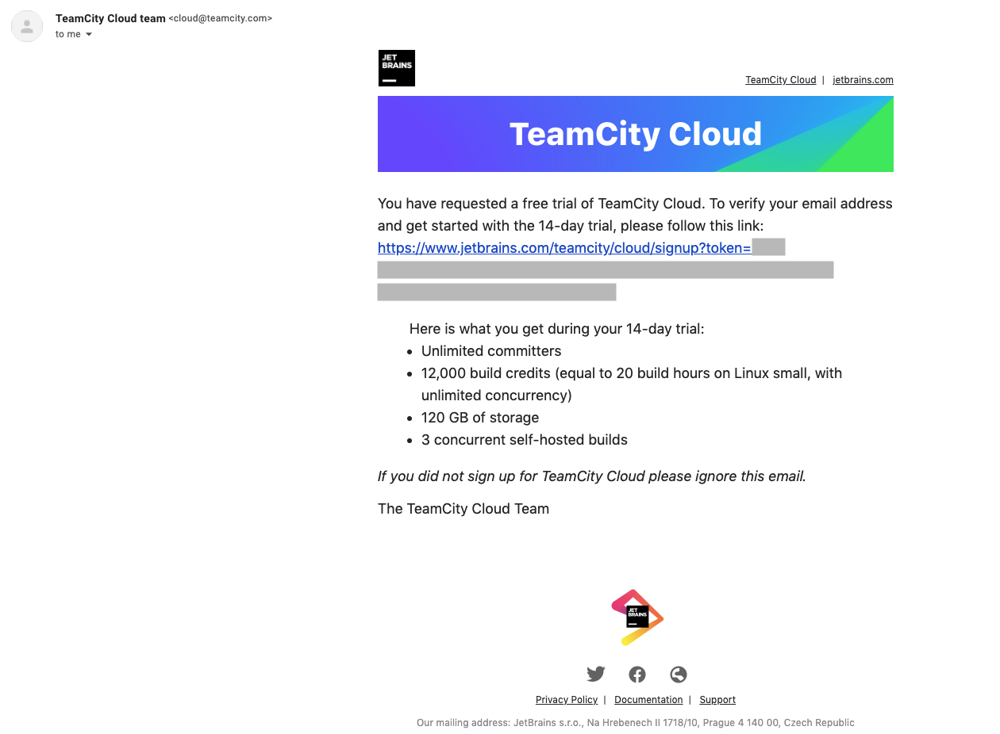
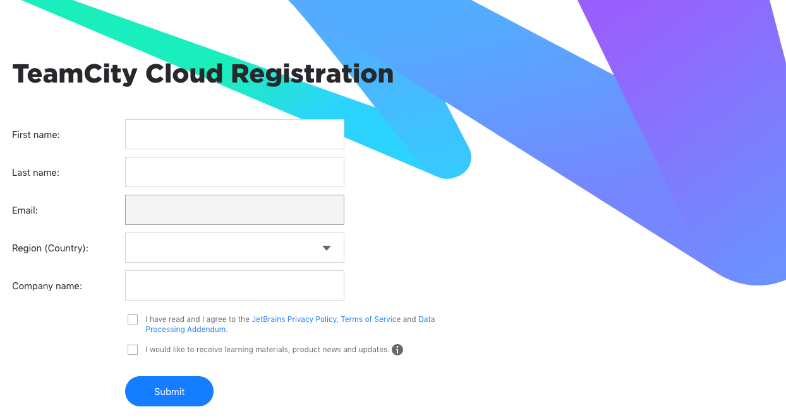
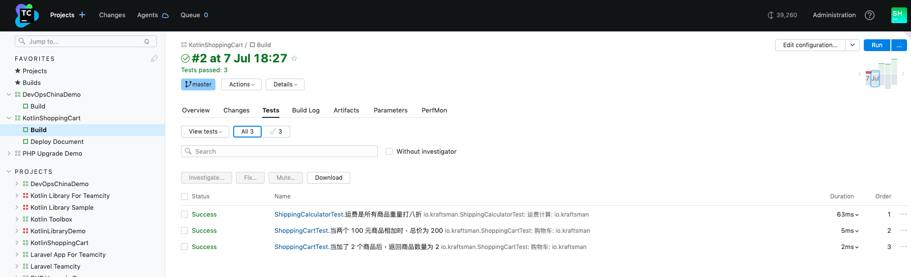
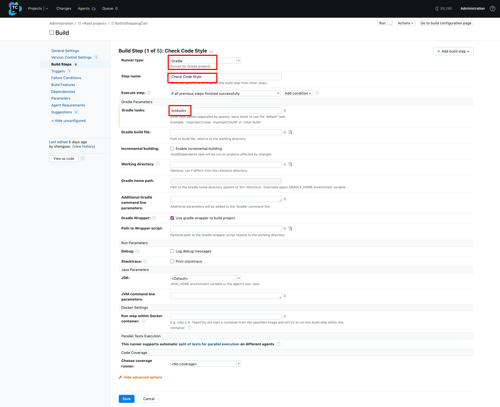
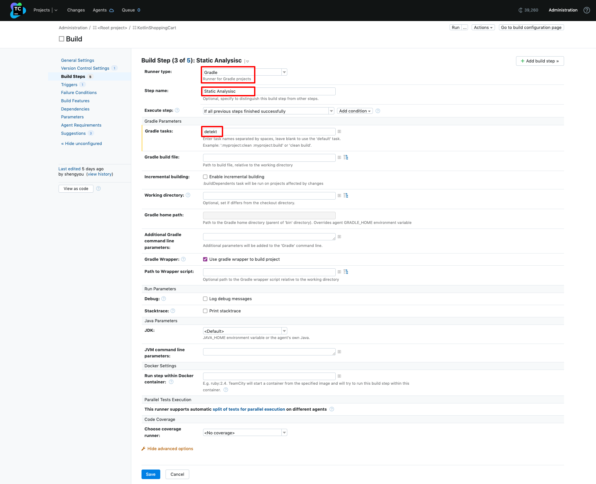
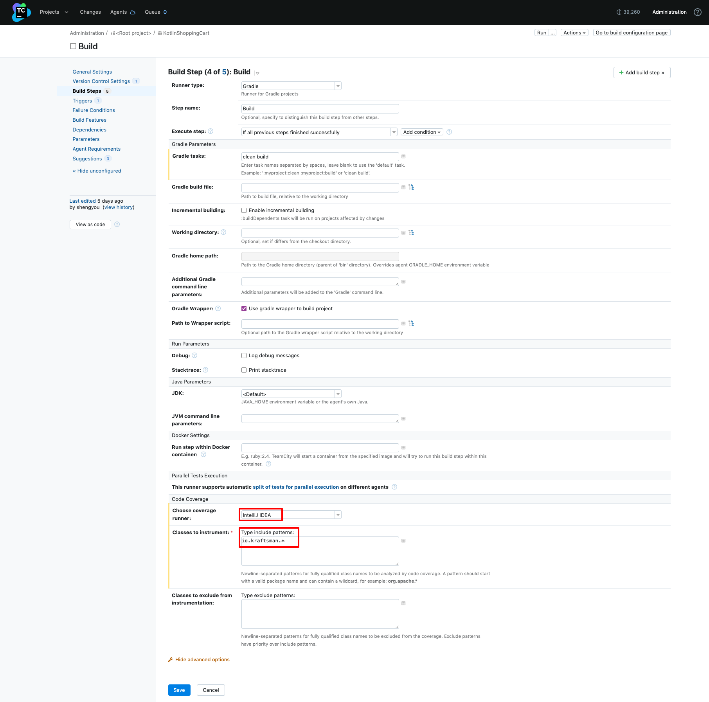
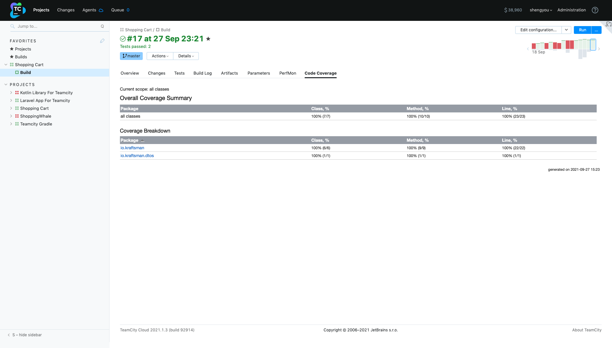
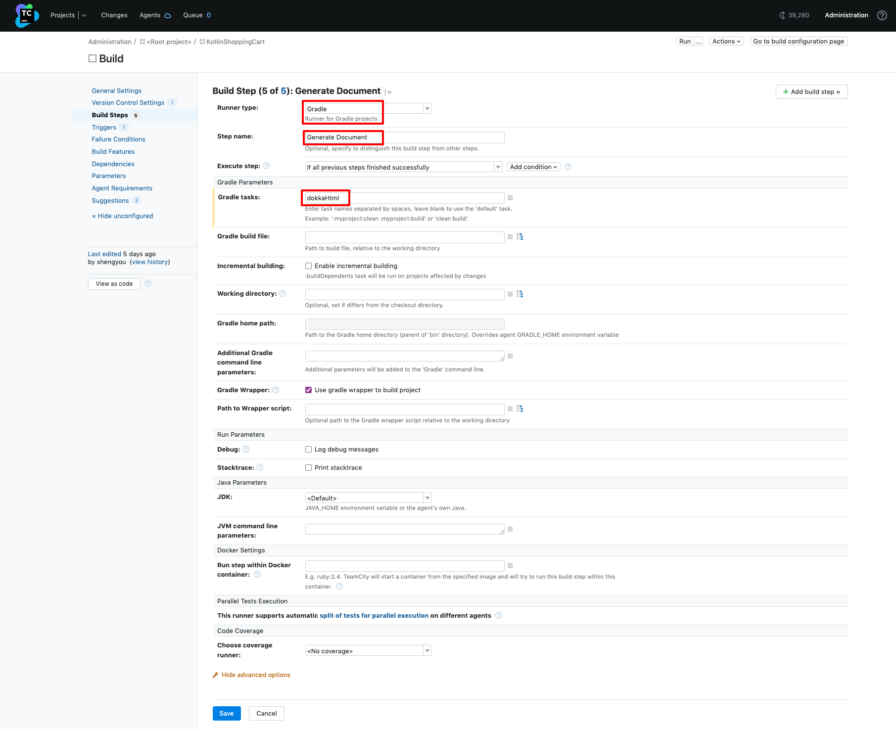
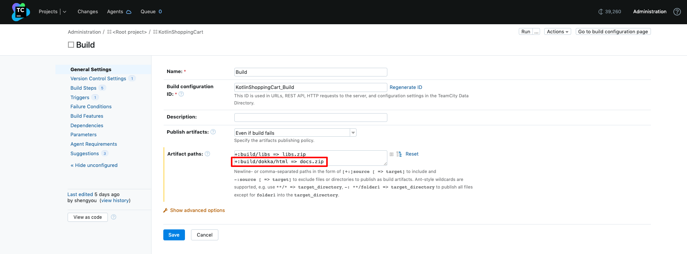

# 面向 DevOps 新手的 TeamCity 快速入门


## 本教程学习材料

* [视频](https://www.bilibili.com/video/BV1pY4y17754)
* [PPT](https://docs.qq.com/pdf/DTmlIRFBJWllsaGJx)
* [练习用代码仓库](https://github.com/shengyou/china-devops-teamcity-lab)

## TeamCity 简介

* 由 JetBrains 推出的团队工具，协助团队做构建管理、持续集成及持续部署的工作。
* 第一版发布于 2006 年，积累 JetBrains 内部超过 15 年构建及部署经验的产品。
* TeamCity 可说是 JetBrains [Dogfooding](https://www.bilibili.com/video/BV1Dg411f7iX) 的代表，在早期没有 CI/CD 解决方案时，由团队自建而生的产品。

## 为什么选择 TeamCity？

* 高颜值 Web UI，新手小白也能立即上手
* 与 JetBrains IDE 深度集成，开发者不需离开 IDE 即可完成工作
* 可用高语意、IDE 友好的 Kotlin DSL 描述设置，大规模设置更轻松

## 版本

* TeamCity (on-premises)
  - 可至官网下载打包好的 Jar 文件，搭配 JVM 运行。
  - 可至 Docker Hub 下载官方发布的 Image，以 Docker 运行。
  - 提供不限用户、不限编译时间、100 个 Build Configuration、3 个 Agent 的免费额度。
  - 开源项目可申请免费授权。
* TeamCity Cloud
  - TeamCity 团队提供的云服务。
  - 免安装、不限用户、并发运行、完全托管。
  - 提供 14 天免费试用 (中国 DevOps 社区可申请延长试用)。

## 安装

* 以 Jar 文件安装
  - 安装 JDK 8 (推荐以 SDKMAN 安装)。
    ```shell
    # 安装 SDKMAN
    $ curl -s "https://get.sdkman.io" | bash
    
    # 安装 OpenJDK 8
    $ sdk install java 8.0.332-tem
    ``` 
  - 至 [TeamCity 官网下载页](https://www.jetbrains.com/teamcity/download/#section=on-premises) 下载 Jar 文件，请选 Linux (.tar.gz) 文件下载。
  - 解压缩下载的文件，将解开的目录并放在 `/opt` 底下。
  - 开启终端，将目录切换到 TeamCity 文件夹，运行 `bin` 文件夹里的 `runAll` 脚本。
    ```shell
    $ cd <TeamCity 目录>
    $ bash ./bin/runAll.sh start
    ```
  - 以浏览器开启 `http://localhost:8111/` 完成首次启用设置
  - 设置 Data 文件夹路径。
    
  - 设置数据库。
    
  - 同意使用条款。
    
  - 设置 admin 帐号密码。
    
  - 完成首次启用设置！
    
* 以 Docker 运行
  - 安装 Docker (以 Ubuntu 为例)。
    ```shell
    # 设定 Repository
    $ sudo apt-get update
    $ sudo apt-get install \
        apt-transport-https \
        ca-certificates \
        curl \
        gnupg \
        lsb-release
  
    # 设定 Docker 官方 GPG key
    $ curl -fsSL https://download.docker.com/linux/ubuntu/gpg | sudo gpg --dearmor -o /usr/share/keyrings/docker-archive-keyring.gpg
  
    # 设置 Stable Repository (以 AMD64 为例)
    $ echo "deb [arch=amd64 signed-by=/usr/share/keyrings/docker-archive-keyring.gpg] https://download.docker.com/linux/ubuntu \
        $(lsb_release -cs) stable" | sudo tee /etc/apt/sources.list.d/docker.list > /dev/null
  
    # 安装 Docker
    $ sudo apt-get update
    $ sudo apt-get install docker-ce docker-ce-cli containerd.io  
    ```
  - 运行 TeamCity 容器。
    ```shell
    $ docker run -it --name teamcity-server-instance \
        -v <path to data directory>:/data/teamcity_server/datadir \
        -v <path to logs directory>:/opt/teamcity/logs \
        -p <port on host>:8111 \
        jetbrains/teamcity-server
    ```
  - 以浏览器开启 `http://localhost:8111/` 完成首次启用设置
  - 设置 Data 文件夹路径。
    
  - 设置数据库。
    
  - 同意使用条款。
    
  - 设置 admin 帐号密码。
    
  - 完成首次启用设置！
    
* 开通 TeamCity Cloud
  - 在 [TeamCity Cloud 登录页](https://www.jetbrains.com/teamcity/signup/)输入 Email 申请开通。
  - 收取邮件并点击邮件里的 URL。
    
  - 在注册页面依表单输入个人信息。
    
  - 设置 Instance URL。
     
  - 设置 admin 帐号密码。
    
  - 同意使用条款。
    
  - 完成开通 TeamCity Cloud！
    

## TeamCity 运作流程

TeamCity 是一个 Server 搭配 Agent 的架构，在正式使用前，预先了解 Server 及 Agent 的架构与分工，有助于了解整体工作流程。TeamCity 的运作流程可用下图来说明：


* 在 TeamCity 里创建项目后，TeamCity Server 会持续侦测 (Polling or Webhook) 代码仓库的变更。
* 当 TeamCity 发现有变更时，会将变更信息储存在数据库里。
* 当 Trigger 发现数据里的变更时，就会依照 Build Configuration 初始化构建。
* 被 Trigger 的构建任务就会被放进 Queue 里。
* 构建任务会被指派给一个闲置且符合构建条件的 Agent。
* Agent 依照 Build Configuration 逐一运行，运行时会将生成的报告同步送回 Server。
* 构建完成后，Agent 会将 Artifact 送回 Server 储存。

## 重要名词解释

* **TeamCity Server**：TeamCity 的管理中心，负责监控所有连线到的 Agent，依照 Agent 的环境分配 Queue 里的构建任务并显示报告。
* **Database**：储存包括代码仓库的变更、构建历史、Agent 及 Queue 信息、帐号及权限等信息。
* **Build Agent**：实际运行构建的程序，依项目需求的不同，可以将 Agent 安装在不同平台、不同操作系统并搭配不同运行环境来运行。
* **Build Configuration**：设置 VCS 来源、Trigger、Build Step 的组合。
* **Build Step**：在构建过程中实际执行的任务，每一个步骤会以特定的 Runner 运行特定工具（比方说 Ant、Gradle、MSBuild、NUnit、静态分析)。
* **Build Trigger**：Trigger 用于事件发生时，启动对应的构建任务。TeamCity 支持数种 Trigger，比方说 VCS Trigger 或 Timer Trigger 等。
* **Build Queue**：储放已被 Trigger、等待被运行的任务清单，TeamCity 会将这些任务分配给符合运行条件且闲置的 Agent 运行。
* **Build Artifact**：构建完成后产生的文件，比方说 Jar/War、报表、日志等，可依需求下载使用。

## 设计项目的发布流水线

不论项目再怎么复杂，为项目建立发布流水线的第一步，就是先用 **人工** 把所有构建任务运行一次，并将所有要运行的命令手写下来。本教程以一个用 Kotlin 编程语言撰写的 ShoppingCart 项目为例，流水线的设计如下：

* 以 Gradle 运行构建并生成 Artifact
* 以 kotest 运行测试并生成覆率报告
* 以 ktlint 检查 Coding Style
* 以 Qodana 和 detekt 运行静态分析
* 以 Dokka 生成 API 文档
* 部署 API 文档

## Lab 1：完成第一个构建

有了上面的蓝图后，接下来用三个 Lab 逐步以 TeamCity 将发布流水线搭建起来。第一步要先在 TeamCity 里完成第一个构建，确认项目可顺利编译。

* 以 Admin 帐号登入 TeamCity，点选上方菜单最右边的 Administration 的链接进入设置，选择左侧栏菜单里的 Projects，点选右边的 Create project 按钮。
  
* TeamCity 支持从 GitHub、Bitbucket Cloud、GitLab 引入代码仓库，或是提供 Repository URL 也行。练习时可直接使用笔者的[代码仓库](https://github.com/shengyou/shopping-cart)，输入后按 Process。
  
* 设置 Project Name (自动以 Repo 名称代入)、Build Configuration Name (默认为 Build)、Default Branch (默认为 main)。没有需求的话全以默认值代入即可。
  
* 有了 Build Configuration 后，接着要设置 Build Step，也就是构建过程中要运行的任务步骤。TeamCity 会自动扫描 Repository 使用的开发工具，扫描后列出可运行的 Build Step。以演示项目为例，TeamCity 发现有两个动作可以做，一个是 Gradle、一个是 Command Line。我们只需要 Gradle 即可，勾选 Gradle 选项，点 Use selected 进到下一步。
  
* 在构建完成后，要将生成的 Artifact 储存下来。回到 Build 的 General Settings 设置，在 Artifact paths 设置要储存的文件夹路径为 `+:build/libs => libs.zip`。
  
* 完成后就可以点选划面右上方的 Run 按钮执行第一次的建置工作。
  
* TeamCity 会自动跳转至构建运行的页面，我们可以即时看到 TeamCity 正在运行的任务，TeamCity 会以时间线显示构建过程，并可实时查看终端输出。若构建过程没有发生错误，则那这个建置就会被视为成功，您可以看到 TeamCity 会以绿色字及打勾的图标来表示构建结果。
  
* 切换到 Artifact Tab，可以看到构建生成的 Artifact，可直接点击下载。
  
* 由于 Gradle 在运行构建时，也会一并运行测试，可以在 Tests Tab 里看到该次构建运行测试的结果。
  

## Lab 2：依计划增加更多 Build Step

第二个 Lab 要依照流水线计划增加更多 Build Step，包括以 ktlint 检查 Coding Style，以 Qodana 和 detekt 运行静态分析，并为测试生成覆盖率报告。

* 转至项目设置，进入 Build Step 设置，新增一个 Build Step。
  
* 由于演示代码使用 Gradle 集成 ktlint，Runner Type 可使用 Gradle Runner。Step name 可命名为 `Check Code Style`，Gradle tasks 里填入要运行的命令 `lintKotlin`，其余留空按 Save 储存即可。
  
* 再新增一个 Build Step，同样使用 Gradle Runner，Step name 命名为 `Static Analysis`，Gradle tasks 里填入要运行的命令 `detekt`，其余留空按 Save 储存即可。
  
* 再新增一个 Build Step，改用 Qodana Runner，Step name 命名为 `Qodana Scan`，Tools 里选择 Code Inspection，Linter 选 Qodana for JVM，其余留空按 Save 储存即可。
  
* 回到 Build Step 页面，编辑 Build 的设置，下方有一个 Code Coverage 的区块，把 Choose coverage runner 从 <No coverage> 改成 IntelliJ IDEA，而 Classes to instrument 则输入 `io.kraftsman.*`，表示只要是在 io.kraftsman 这个 Package 底下的所有 Class 都要生成覆盖率报告，完成后按 Save 储存。
  
* 若有需要可以调整 Step 的顺序，完成后点击右上角 Run 按钮运行构建，并转至 Build 页面看构建结果。页面中间多了一个 Code Coverage 的 Tab，点击 Tab 就可以看到 TeamCity 把覆盖率报告显示在 Tab 内，不需要将生成的报告上传到其他服务器上，非常方便！
  
  
  

## Lab 3：生成并部署 API 文档

第三个 Lab 要依照流水线计算生成项目的 API 文档，并将文档部署至指定服务器。演示的代码仓库使用的是 Dokka 文件引擎，由于 Dokka 也有提供 Gradle 插件，因此在 TeamCity 里一样使用 Gradle Runner 即可生成文件。

* 转至项目 Build Step 设置，新增一个 Step，Runner Type 选 Gradle、Step name 输入 `Generate Document`、Gradle tasks 输入 `dokkaHtml`，其他保留默认后按 Save 储存。
  
* 虽然 Build Step 会生成文件，但别忘了要把文件变成 Artifact 的一部份。回到项目的 Build Configuration 设置页，选择左侧边栏的 General Settings，在 UI 下方 Artifact paths 里指定要保存的路径 `+:build/dokka/html => docs.zip`。
  

接下来，与前面构建的步骤不同，部署文件的任务不需要跟构建绑在一起，可以单独创建一个 Build Configuration，等需要部署时再「人工部署」。

* 进入项目设置，在 General Settings 里，创建一个新的 Build Configuration。
  
* 这次部署的来源不是原本的 VCS，所以改成选择 Manually 方式，并把这个 Build Configuration 取名为 Deploy document。 
  
* 下一步会转至 Deploy document 设置，这里想将前面 Build Configuration 生成的 Artifact 当成来源，因此要把上一个 Build Configuration 设为相依 (Dependencies)。点选左边侧边栏的 Dependencies，选择画面上的 Add new artifact dependency。
  
* 在弹出式窗口里，设定 Depend on 为 Shopping Cart / Build，Get artifacts from 为 Latest successful build (上一次成功的构建)，Artifacts rules 要包含要从 Artifact 拿出的文件路径 `+:docs.zip`，完成后按 Save 储存。
  
* 切换到 Build Steps，并点击 Add build step。第一步先把 `docs.zip` 上传到目标主机上，Runner type 选 SSH Upload、Step name 取名为 Upload，Target、Port、Username 请依照目标服务设置，Paths to sources 则是设定要上传的文件，完成后按 Save 储存。
  
* 上一步只把 API 文件的压缩档上传，还没办法让用户浏览。所以要搭配第二步动作，直接 SSH 进服务器，把压缩档解开放到 Nginx Site 底下。回到 Build Steps 设定再新增第二个 Build Step，Runner type 选 SSH Exec，Step name 取名为 Publish，Target、Port、Username 请依照目标服务器设置，Commands 就直接把在服务器上运行的 Shell Script 直接黏贴上去，设定好后按 Save 储存。（此步骤请依照自己的环境做设置，以下命令仅供参考）

  ```shell
  mv upload/docs.zip upload/docs-%build.number%.zip
  unzip upload/docs-%build.number%.zip -d upload/docs-%build.number%
  mv upload/docs-%build.number% docs/
  ``` 

  

* 完成后回到首页，每次在 Build 那步的 API Docs Tab 确认没问题，想要部署 API 文件到服务器上时，就可以点选 Deploy document 旁的 Run，这样 TeamCity 就会把文件部署到服务器。
  

## 举一反三

由于演示代码是以 Kotlin 编写，所以在设计 Build Step 时，使用的构建工具都是以 Gradle 为核心。而 TeamCity 做为一个通用的持续集成服务器，并没有限制使用的构建工具，其支持多种 Build Runner，开发者可依据项目需求运行所需的构建工具，也可搭配 Docker 搭建运行环境。

以下依不同开发生态系举几个例子：

* JVM 项目：使用 `Gradle`、`Maven` 或 `Ant` Runner
* JavaScript 项目：使用 `Node.js` Runner
* Python 项目：使用 `Python` Runner
* PHP 项目：以 `Command Line` Runner 搭配 `composer` Docker

用于部署的 Runner：

* 打包 Image：使用 `Docker` Runner
* 直接上传：使用 `SSH Upload` 或 `FTP Upload` Runner
* 直接运行命令：使用 `SSH Exec` Runner

## 集成 JetBrains IDE

开发者若使用 JetBrains IDE，可安装 [TeamCity 插件](https://plugins.jetbrains.com/plugin/1820-teamcity)，在 IDE 内会多一个 TeamCity 窗口，登入帐号密码后，即可在 IDE 里查看 TeamCity 的 Build Log，不需离开 IDE、不需中断心流，更高效的完成工作。


## 以 Kotlin DSL 描述设置

TeamCity 也可用设置文件来描述 CI/CD 行为，大规模设置更轻松。但有别于其他解决方案，TeamCity 使用的语法是 Kotlin DSL 而不是 YAML，原因有二：

* DSL 可依场景设计领域专用语言，让不是开发者的团队成员也能迅速理解并上手，降低维护难度。
* Kotlin DSL 完全是 Kotlin 语法，不需要额外的语法检查器即可用 Kotlin 编译器码证语法，也可以直接在 IDE 做语法提示，编写代码时更安全。

新手不需要手动撰写 TeamCity 的 Kotlin DSL，可直接从 Web UI 导出： 

* 转至项目设置 General Settings，点击右上方 Actions 下拉菜单，选择 Download settings in Kotlin format...。
  
* TeamCity 会将项目设置导出成 Zip 文件。
* 将下载下来的 Zip 解压缩，把文件夹重新命名为 `.teamcity` 后，放在项目根文件夹底下。
* 转至项目设置 Versioned Settings，点取 UI 上的 Synchronization enabled 并按下 Apply 按钮，未来 TeamCity 就会以项目内的设置文件运行设置，Web UI 变为只读。
  

## 延伸主题讨论

本教程以 DevOps 新手快速入门 TeamCity 为目标，以熟悉 TeamCity 基本操作为主。不过 TeamCity 还有更多特性可深入研究，以下列出进阶主题供同学参考：

* **定制化 Agent**：若项目有用到特殊的环境或工具，可自行定制 Agent 后挂载至 TeamCity Server 上使用。或是定制项目所需的 Docker Image，在设置 Build Step 时使用指定的 Image 运行。
* **调用不同 Trigger**：演示仅用到 VCS Trigger，TeamCity 还支持 Schedule Trigger、Branch Remote Run Trigger 等，可弹性组合以符合更种场景。
* **设定 Build Feature**：TeamCity 支持在构建完成后触发更多动作，比方说合并 PR、自动提交等，可将更多流程自动化。
* **与团队工具集成**：TeamCity 可与其他团队工具集成，比方说与市场上常见的 Issue Tracker 集成，或是与 JetBrains IDE 集成，让开发流程更顺畅。

## 官方学习材料

TeamCity 团队提供丰富的文档供开发者自学，统整学习材料清单如下：

* **[TeamCity 视频教程](https://www.youtube.com/playlist?list=PLQ176FUIyIUZVX0oSnlZh3mfqE3ZWDEZh)**：由 TeamCity 布道师 Marco 亲自录制的视频教程，是最高效的学习材料！若想学习 TeamCity，可先由这份教程入门。
* **[官方教程](https://www.jetbrains.com/teamcity/tutorials/)**：若您比较喜欢主题式的学习，尤其是想了解如何将 TeamCity 应用于项目的开发生态系，那可以从这份教程开始，直接挑您想看的编程语言即可。
* **[官方文档](https://www.jetbrains.com/help/teamcity/teamcity-documentation.html)**：TeamCity 团队提供完整的官方文档，遇到问题时可用关键字搜索对应的主题。
* **[CI/CD 指南](https://www.jetbrains.com/teamcity/ci-cd-guide/)**：若您对 DevOps 的观念及名称有兴趣想深入，TeamCity 团队整理的这份 CI/CD 很值得做为学习时的补充读物。
* **[TeamCity Technology Day](https://www.youtube.com/playlist?list=PLQ176FUIyIUal1FCy2F8KUgVU1ol0O9sU)** ：TeamCity 团队在 2020 年尾举办了一场线上技术日，在这个 YouTube 播放清单里，有很多不同面向的 TeamCity 主题分享，可以挑自己有兴趣的主题来听。
* **[TeamCity Cloud Launch Event](https://www.youtube.com/playlist?list=PLQ176FUIyIUYKymnmoMnzwjyA7jEc39nJ)**：喜欢使用 TeamCity Cloud 的小伙伴，请参考这个 Launch Event 的视频，可以更清楚 TeamCity Cloud 提供的功能与进阶功能。

## Q&A

1. Artifact Path 的语法要怎么写？
   其语法为 `[+:]source [=> target]`。`+:` 指要包含后面的路径，`source` 指要生成压缩文件的路径，`=>` 指要生成压缩文件，`target` 指压缩文件的文件名。更多说明及用例可以参考[官方文档](https://www.jetbrains.com/help/teamcity/cloud/2022.06/configuring-general-settings.html#Artifact+Paths)。

2. 视频里演示时，IDE 的进度条效果是怎么做出来的？
   这是安装了一个名为 [Unicorn Progress Bar](https://plugins.jetbrains.com/plugin/18271-unicorn-progress-bar) 的插件，在 IDE 安装后就能有一样的效果。
