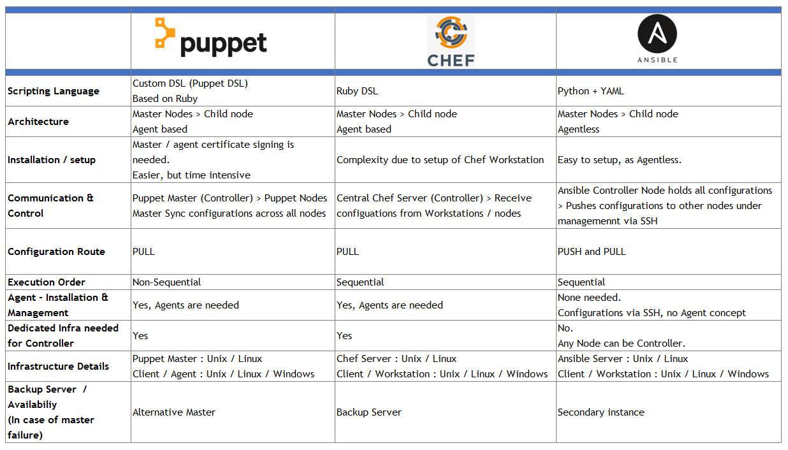

# Ansible 新手入门指南


## Ansible 的发音？


## Ansible 是什么？

[维基百科](https://en.wikipedia.org/wiki/Ansible_(software))：术语 "ansible "是乌苏拉-K-勒古恩在她1966年的小说《罗卡农的世界》中创造的，它指的是虚构的即时通信系统。是一类虚构的设备或技术，能够进行近乎瞬时或比光速更快的通信。

## 创业小传

关于 Ansible 的小故事：“摸鱼创业成功的经典案例！”，看下 Founder, CEO & Chairman - Ansible 的 LinkedIn 你就懂了。

* https://www.linkedin.com/in/saidziouani/
* https://www.linkedin.com/in/timothy-gerla/
* https://www.linkedin.com/in/michaeldehaan/


## 参考信息

Ansible 简介文档：

* https://docs.ansible.com/ansible/latest/index.html
* https://en.wikipedia.org/wiki/Ansible_(software)
* https://www.ansible.com/hubfs//AnsibleFest%20ATL%20Slide%20Decks/Getting%20Started%20with%20Ansible%20-%20Jake.pdf
* https://aap2.demoredhat.com/decks/ansible_best_practices.pdf
* https://www.ansible.com/hubfs/Webinar%20PDF%20slides/%5BWIP%5D%20MBU%20_%20ANA%20_%20Webinar%20-%20Ansible%20Network%20Meta%20Collection.pdf
  
Ansible 和其他几种同类工具的对比：



Ansible 最简化架构图：


## 安装 Ansible

本教程所使用的的 Ansible 是 Fedora 35 上用 pip3 安装的

### 环境说明

控制器 - Contorler ：
* Fedora 35 ：192.168.31.30

被管理的服务器 - Hosts ：

* 本地虚拟机 - Fedora 35 
  * app1 ： 192.168.31.165 
  * app2 ：192.168.31.124
  * db ：192.168.31.58

### 在 macOS 上安装【开发环境】

下面是在操作系统版本 macOS 12.3 (21E230) 上的安装过程，其中第四个步骤需要按实际情况修改。

步骤如下：

1. 先安装 Python3 (步骤省略)
2. 确认 Python3 的版本：`python3 --version`
3. 运行  ` pip3 install ansible` 
4. 在 shell 的环境配置文件加入 Python 的可执行文件路径，例如：我在 ~.zshrc 文件中加入这一行 `export PATH="$PATH:/Users/martinliu/Library/Python/3.8/bin"`，不同的用户名和 Python 版本对应这里的路径不同。
5. 让配置文件生效，运行 `source ~.zshrc`
6. 验证 Ansible 安装的版本，运行 `ansible --version`

### 在 Fedora 35 上安装 【生产环境】

#### 用 dnf 安装

在 Master （controler）上安装部署 Ansble 工具集。

步骤如下：

1. 运行命令 `dnf install ansible -y`
2. 验证 Ansible 安装的版本，运行 `ansible --version`
3. 安装必要的软件包 `dnf install sshpass git -y`

这种安装的版本应该是更老一些，没有 pip 安装的版本新。

#### 用 pip3 安装

下面，我们在 Master （controler）上安装部署 Ansble 工具集。

为了使用到更新版本的 Ansible，我们还需要升级 python 的版本到 >= 3.8；目前 Fedora 35 的默认自带的Python 版本为 3.10.1。

步骤如下：

1. 安装必要的软件包，运行命令 `dnf install python3-pip  sshpass git -y`
2. 升级 `pip3` 用  `python3 -m pip install --upgrade pip`
3. 切换到非 root 用户 （如果有的话  ）
4. 先设置国内的 pypi 安装源 `pip config set global.index-url https://pypi.tuna.tsinghua.edu.cn/simple`
5. 用 `pip3` 安装 Ansible ， 运行 `pip3 install ansible`
6. 验证 Ansible 安装的版本，运行 `ansible --version`

## 配置 Ansble 运行环境

### 初始化控制器 

Ansible 的控制器（Master）通过 SSH 访问和管理被管理的节点，并完成系统、服务配置工作。

首先，在控制器生成 ssh 访问秘钥对。ssh 登陆到控制器，最好切换到非root用户，执行 `ssh-keygen` 命令创建 ssh 密钥对，用于无密码访问其它被服务器节点。

查看所创建的测试用秘钥对的位置：

```sh
[martin@ctl ~]$ ls ~/.ssh
id_rsa  id_rsa.pub
```

尝试使用密码的访问其它被管理服务器，确认你拥有所有正确的密码。（如果你已经有一个统一的访问秘钥，请忽略此步骤）

Ansible 控制器节点的执行引擎的行为特性的配置文件是 ansible.cfg 文件，对此文件路径的搜索顺序如下：

1. ANSIBLE_CONFIG (环境变量中)
2. ansible.cfg (当前目录中) 。
3. ~/.ansible.cfg (当前用户的 home 目录下)
4. /etc/ansible/ansible.cfg （操作系统的路径）- 本教程中使用的方式

在当前用户的 Home 目录中创建一个内容如下的 .ansible.cfg 配置文件 (注意是以句点开头的隐藏文件)

```yml
[defaults]
host_key_checking = false
inventory  = ./hosts.ini
command_warnings = False
deprecation_warnings = False
roles_path = ./roles
nocows = 1
retry_files_enabled = False

[ssh_connection]
control_path = %(directory)s/%%h-%%p-%%r
pipelining = True
```

创建 inventory.v1 配置文件

```yml
# 组织方式：功能、地域、环境
# 应用服务器组
[app]
192.168.31.165 
192.168.31.124

# 数据库服务器组
[db]
192.168.31.58

# 名为 localvm 的嵌套组
[localvm:children]
app
db

# 给嵌套组定义变量，应用于所有服务器
[localvm:vars]
ansible_user=root
ansible_password='devops1234'

```

其他可用的定义方法详见：https://docs.ansible.com/ansible/latest/user_guide/intro_inventory.html 


执行首个 Ansible 命令 `ansible -i inventory.v1 all -m ping` ，正确完成所有被管理节点密码验证后的结果应该类似如下：

```sh
[martin@ctl live]$ ansible -i inventory.v1 all -m ping
192.168.31.58 | SUCCESS => {
    "ansible_facts": {
        "discovered_interpreter_python": "/usr/bin/python3"
    },
    "changed": false,
    "ping": "pong"
}
192.168.31.165 | SUCCESS => {
    "ansible_facts": {
        "discovered_interpreter_python": "/usr/bin/python3"
    },
    "changed": false,
    "ping": "pong"
}
192.168.31.124 | SUCCESS => {
    "ansible_facts": {
        "discovered_interpreter_python": "/usr/bin/python3"
    },
    "changed": false,
    "ping": "pong"
}
```

inventory.v1 配置文件中携带密码是很危险的，下面使用 Ansible 来解决这个问题，被配置好所有被管理节点。

* 创建一个 Ansible 专用的名为 sysops 的用户账号 （不建议使用 root 用户，而是非 root 用户）
* 将其配置为 sudo 提权限并不需要密码的用户。
* 将控制器当前用户新创建的秘钥对的公钥配置部署到所有被管理节点的 sysops 的授权用户中。


下面通过创建第一个 Playbook 来实现对 3 个被管理节点的统一配置。 创建内容如下的文件 `init-users.yml` 

* 使用的模块有 group, lineinfile, user 和 authorized_key 
* 混合使用完成远程系统的用户配置
* 引用了变量文件


```yml
---
- hosts: localvm
  become: true
  # 引用变量文件
  vars_files:
    - vars/default.yml
  tasks:
  # Sudo 用户组配置
    - name: Make sure we have a 'wheel' group
      group:
        name: wheel
        state: present
  # 允许 'wheel' 组里的用户执行sudo可以不输入用户密码
    - name: Set sudo without password
      lineinfile:
          path: /etc/sudoers
          state: present
          regexp: '^%wheel'
          line: '%wheel ALL=(ALL) NOPASSWD: ALL'
          validate: '/usr/sbin/visudo -cf %s'

  # 创建远程命令执行的用户，并配置ssh密钥
    - name: Create a new regular user with sudo privileges
      user:
        name: "{{ create_user }}"
        state: present
        groups: wheel
        append: true
        create_home: true
        shell: /bin/bash

    - name: Set authorized key for remote user
      authorized_key:
        user: "{{ create_user }}"
        state: present
        key: "{{ copy_local_key }}"
```

这个文件引用了一个变量文件 vars/default.yml ，创建这个目录和文件，它的内容如下：

```yml
create_user: sysops
copy_local_key: "{{ lookup('file', lookup('env','HOME') + '/.ssh/id_rsa.pub') }}"
```

现在执行初始化命令 ：`ansible-playbook -i inventory.v1 init-users.yml` ，结果如下：

```sh
[martin@ctl live]$ ansible-playbook -i inventory.v1 init-users.yml

PLAY [localvm] *********************************************************************************

TASK [Gathering Facts] *************************************************************************
ok: [192.168.31.124]
ok: [192.168.31.165]
ok: [192.168.31.58]

TASK [Make sure we have a 'wheel' group] *******************************************************
ok: [192.168.31.165]
ok: [192.168.31.58]
ok: [192.168.31.124]

TASK [允许 'wheel' 组里的用户执行sudo可以不输入用户密码] ***************************************
changed: [192.168.31.58]
changed: [192.168.31.124]
changed: [192.168.31.165]

TASK [Create a new regular user with sudo privileges] ******************************************
changed: [192.168.31.165]
changed: [192.168.31.124]
changed: [192.168.31.58]

TASK [Set authorized key for remote user] ******************************************************
changed: [192.168.31.124]
changed: [192.168.31.58]
changed: [192.168.31.165]

PLAY RECAP *************************************************************************************
192.168.31.124             : ok=5    changed=3    unreachable=0    failed=0    skipped=0    rescued=0    ignored=0
192.168.31.165             : ok=5    changed=3    unreachable=0    failed=0    skipped=0    rescued=0    ignored=0
192.168.31.58              : ok=5    changed=3    unreachable=0    failed=0    skipped=0    rescued=0    ignored=0

[martin@ctl live]$
```

ansible-playbook 命令是解析和执行 ansible 的 Playbook 脚本的命令。

从controler上验证无密码SSH密钥认证的登陆，执行 `ssh sysops@192.168.31.124`；查看对方用户的 .ssh 目录。

在所有host上我们配置好了一个Ansible专用的无sudo密码的普通用户。优化 inventory.v1 文件，删除其中的用户名和密码，创建内容如下的 inventory.v2 文件：

```yml
# 组织方式：功能、地域、环境
# 应用服务器组
[app]
192.168.31.165
192.168.31.124

# 数据库服务器组
[db]
192.168.31.58

# 名为 localvm 的嵌套组
[localvm:children]
app
db

# 给嵌套组定义变量，应用于所有服务器
[localvm:vars]
ansible_user=sysops
ansible_ssh_private_key_file=~/.ssh/id_rsa
ansible_ssh_common_args='-o StrictHostKeyChecking=no'
```

最后用首个执行的 Ansible 命令 `ansible -i inventory.v2 all -m ping` 验证所有主机是否可以用SSH正常访问，确认得到全绿的输出结果。

```sh
[martin@ctl live]$ ansible -i inventory.v1 all -m ping
192.168.31.58 | SUCCESS => {
    "ansible_facts": {
        "discovered_interpreter_python": "/usr/bin/python3"
    },
    "changed": false,
    "ping": "pong"
}
192.168.31.124 | SUCCESS => {
    "ansible_facts": {
        "discovered_interpreter_python": "/usr/bin/python3"
    },
    "changed": false,
    "ping": "pong"
}
192.168.31.165 | SUCCESS => {
    "ansible_facts": {
        "discovered_interpreter_python": "/usr/bin/python3"
    },
    "changed": false,
    "ping": "pong"
}
```

到此为止，我们完成了 Ansible 运行环境的配置，包括：

* 准备 ssh 登录的秘钥 
* 配置控制器节点的基础配置文件
* 初始化三个被管理几点的远程登录用户账号
* 创建了优化的 Inventory 主机清单文件
* 使用 ping 模块再次确认所有被管理主机的 ssh 登录

## 用 Ansible 命令执行运维工作 ｜ Ad-hoc 

用下面的命令体会 Ansible 的特性和内置模块的功能。在执行下面的命令之前，复制 inventory.v2 文件为 hosts.ini 文件。这样命令可以更加简洁。

### 默认并发执行

运行多次下面的命令，了解多线程并发的特性。

使用 -a 参数远程执行命令

```sh
ansible localvm -a "hostname"
ansible localvm -a "hostname"
ansible localvm -a "hostname"

ansible localvm -a "hostname" -f 1
ansible localvm -a "hostname" -f 1
ansible localvm -a "hostname" -f 1
```

### 环境状况检查

使用 -a 参数的远操作系统里的原生命令。

```sh
ansible localvm -a "df -h"

ansible localvm -a "free -m"

ansible localvm -a "date"
```

### 使用 Ansible 模块做变更

使用 Ansible 的核心模块变更系统。

* yum 和 servce 模块混用
* 搭配 -a 的命令行执行

```sh
ansible localvm -a "date"

ansible localvm -b -m yum -a "name=chrony state=present"

ansible localvm -b -m service -a "name=chronyd state=started enabled=yes"

ansible localvm -b -a "chronyc tracking"

ansible localvm -a "date"
```

## 部署目标应用系统

应用系统配置部署流程简介：

* 需要在 App1 和 App2 上配置好 Django 运行环境
* 需要在 DB 上安装 Mariadb
* 在所有服务器上启动防火墙服务，并配置好需要开放的端口
* 在两个 App 服务器上从 GitHub 安装并启动 Django 应用

### 配置 Django 运行环境

开始编写第一个应用系统在一套服务器上的综合配置 Playbook。

配置应用服务器：安装 python3 和 django

* yum 和 pip 模块的混用
* 辅助 -a 的命令行执行

```sh
ansible app -b -m yum -a "name=python3-pip state=present"

ansible app -b -m pip -a "name=django<4 state=present"

ansible app -a "python3 -m django --version"

```

本教程中使用了先用逐条 Ansible 配置指令调试的方式，然后在将其翻译到 Playbook 中的方式，在熟悉了这个开发过程和 Ansible 的常用模块后，我们则可以直接开发 Playbook 了。

根据以上的所有 Ansible 指令，创建名为 app-stack.yml 的文件，内容如下：

```yml
---
- hosts: app
  become: true
  tasks:
    - name: Config NTP Server  # 配置 ntp 服务器
      yum:
        name: chrony
        state: present
    - name: Start NTP service # 启动 chronyd 服务
      service:
        name: chronyd
        state: started
        enabled: yes
    - name: Install Python3&pip 
      yum:
        name: python3-pip
        state: present
    - name: Install django package
      pip:
        name: django<4
        state: present
```

下面执行 ansible-play app-stack.yml 可以得到相同的结果状态。

### 配置数据库服务器

安装 Mariadb 服务器

* yum、service 和 防火墙模块混用

逐条执行下面的调试命令：

```sh
ansible db -b -m yum -a "name=mariadb-server state=present"

ansible db -b -m service -a "name=mariadb state=started enabled=yes"

ansible db -b -m yum -a "name=firewalld state=present"

ansible db -b -m service -a "name=firewalld state=started enabled=yes"

ansible db -b -m firewalld -a "port=3306/tcp zone=public state=enabled permanent=yes"

ansible db -b -m yum -a "name=python3-PyMySQL state=present"

```

在以上命令的结果都符合预期后，在 app-stack.yml 中增加如下内容

```yml

- hosts: db
  become: true
  tasks:
    - name: Install Mariadb Server
      yum:
        name: mariadb-server,python3-PyMySQL
        state: present
    - name: Start DB service
      service:
        name: mariadb
        state: started
        enabled: yes
    - name: Install firewalld
      yum:
        name: firewalld
        state: present
    - name: Start Firewalld service
      service:
        name: firewalld
        state: started
        enabled: yes
    - name: enable db port
      firewalld:
        port: 3306/tcp
        permanent: yes
        state: enabled
```

在控制器上执行更新后的 Playbook，运行命令 ansible-play app-stack.yml ，确保执行结果输出正常。

### 部署 Django 应用系统

从 GitHub 中部署目标应用代码：

* 运用 git ，yum ， serviice 和 firewalld 模块
* 用命令行方式启动应用

```sh
ansible localvm -b -m yum -a "name=git state=present"

ansible app -b -m git -a "repo=https://github.com/martinliu/hellodjango.git \
dest=/opt/hello update=yes"

ansible app -b -m firewalld -a "port=8000/tcp state=enabled permanent=yes"

ansible app -b -m service -a "name=firewalld state=reloaded enabled=yes"

ansible app -b -a "sh /opt/hello/run-hello.sh"
```

在浏览器中输入应用的访问网址： http://192.168.31.165:8000/hello/ ，应该在两个 app 服务器上都可以看到相同的结果。


在 app-satck.yml 中加入下面的内容

```yml
    - name: Deploy from github
      git:
        repo: https://github.com/martinliu/hellodjango.git
        dest: /opt/hello
        update: yes
    - name: enable app 8000 port
      firewalld:
        port: 8000/tcp
        permanent: yes
        state: enabled
    - name: Reload Firewalld service
      service:
        name: firewalld
        state: reloaded
        enabled: yes
    - name: Start my hello app
      command: sh /opt/hello/run-hello.sh
```

执行最后的应用部署 ansible-playbook app-stack.yml 确认执行后的结果正常，用浏览器可以正常访问 Django 应用页面。

## 总结

希望大家通过本教程学会：

* Ansible 运行环境的基础配置
* Ansible 的 ad-hoc 方式用法
* Ansible 核心中的几个常用模块
* 逐步编写部署目标应用的 Ansible Playbook 

## 呼唤下一位鉴宝人

建议分享的内容如下（不限于此）：

* Role 的开发
* CI/CD 工具中执行 Playbook
* 容器，k8s 相关主题
* AWX Ansible 相关主题
* 生产项目中的经验分享 