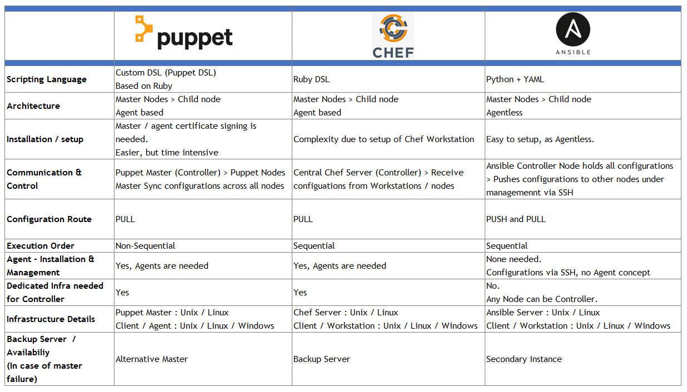

# Ansible 新手入门指南


Ansible 的发音？是什么意思？出处？


[维基百科](https://en.wikipedia.org/wiki/Ansible_(software))：术语 "ansible "是乌苏拉-K-勒古恩在她1966年的小说《罗卡农的世界》中创造的，它指的是虚构的即时通信系统。是一类虚构的设备或技术，能够进行近乎瞬时或比光速更快的通信。

关于 Ansible 的小故事：“摸鱼创业成功的经典案例！”，看下 Founder, CEO & Chairman - Ansible 的 LinkedIn 你就懂了。

* https://www.linkedin.com/in/saidziouani/
* https://www.linkedin.com/in/timothy-gerla/
* https://www.linkedin.com/in/michaeldehaan/


Ansible 简介 文档：

* https://docs.ansible.com/ansible/latest/index.html
* https://en.wikipedia.org/wiki/Ansible_(software)
* https://www.ansible.com/hubfs//AnsibleFest%20ATL%20Slide%20Decks/Getting%20Started%20with%20Ansible%20-%20Jake.pdf
* https://aap2.demoredhat.com/decks/ansible_best_practices.pdf
* https://www.ansible.com/hubfs/Webinar%20PDF%20slides/%5BWIP%5D%20MBU%20_%20ANA%20_%20Webinar%20-%20Ansible%20Network%20Meta%20Collection.pdf
  
Ansible 和其他几种同类工具的对比：


Ansible 最简化架构图：


## 1 - 安装 Ansible

### 1.1 在 macOS 上安装

操作系统版本 macOS 12.3 (21E230) - Apple M1 Max

步骤如下：

1. 先安装 Python3 (步骤省略)
2. 确认 Python3 的版本：`python3 --version`
3. 运行  ` pip3 install ansible` 
4. 在 shell 的环境配置文件(例如：~.zshrc)中加入这一行 `export PATH="$PATH:/Users/martinliu/Library/Python/3.8/bin"`
5. 让配置文件生效，运行 `source ~.zshrc`
6. 验证 Ansible 安装的版本，运行 `ansible --version`

### 1.2 在 CentOS 8 上安装

#### 用 yum 安装

步骤如下：

1. 运行命令 `yum install ansible -y`
2. 验证 Ansible 安装的版本，运行 `ansible --version`
3. 安装必要的软件包 `yum install sshpass git -y`


#### 用 pip3 安装

步骤如下：

1. 运行命令 `yum install python3-pip -y`
2. 升级 `pip3` 用  `python3 -m pip install --upgrade pip`
3. 切换到非 root 用户 （如果有的话  ）
4. 用 `pip3` 安装 Ansible ， 运行 `pip3 install ansible`
5. 验证 Ansible 安装的版本，运行 `ansible --version`
6. 安装必要的软件包 `yum install sshpass git -y`

## 2 - 环境准备

### 环境说明

控制器 - Contorler ：
* macOS ： localhost
* centOS 8 ：192.168.1.136

被管理的服务器 - Hosts ：

* 本地虚拟机 - cenotOS 8 
  * app1 ： 192.168.1.167 
  * app2 ：192.168.1.239 
  * db ：192.168.1.241 

* Azure 虚拟机 - cenotOS 8 
  * app1 ： 
  * app2 ： 
  * db ： 

### 初始化无 SSH 密钥访问

先ssh登陆到控制器，最好切换到非root用户，执行 `ssh-keygen` 命令创建 ssh 密钥对，用于无密码访问其它服务器。

首先，尝试使用 有密码的访问。

创建 ansible.cfg 配置文件

```yml
[defaults]
host_key_checking = false
#ansible_connection = paramiko
inventory  = ./hosts.ini
command_warnings=False
```

创建 inventory.v1 配置文件

```yml
# 应用服务器组
[app]
192.168.1.167
192.168.1.239

# 数据库服务器组
[db]
192.168.1.241

# 名为 localvm 的嵌套组
[localvm:children]
app
db

# 给嵌套组定义变量，应用于所有服务器
[localvm:vars]
ansible_user=root
ansible_password='devops1234'
```

执行首个 Ansible 命令 `ansible -i inventory.v1 all -m ping` ，结果如下：

```sh
[root@ansible-controller lab01]# ansible -i inventory.v1 all -m ping
192.168.1.241 | SUCCESS => {
    "ansible_facts": {
        "discovered_interpreter_python": "/usr/libexec/platform-python"
    },
    "changed": false,
    "ping": "pong"
}
192.168.1.239 | SUCCESS => {
    "ansible_facts": {
        "discovered_interpreter_python": "/usr/libexec/platform-python"
    },
    "changed": false,
    "ping": "pong"
}
192.168.1.167 | SUCCESS => {
    "ansible_facts": {
        "discovered_interpreter_python": "/usr/libexec/platform-python"
    },
    "changed": false,
    "ping": "pong"
}
```

配置文件中携带密码是很危险的，下面使用 Ansible 来解决这个问题，创建第一个 playbook ，新建文件 `init-users.yml` ，执行初始化命令 ：`ansible-playbook -i inventory.v1 init-users.yml` ，结果如下：


```sh
[root@ansible-controller lab01]# ansible-playbook -i inventory.v1 init-users.yml
[WARNING]: Invalid characters were found in group names but not replaced, use -vvvv to see details
ERROR! vars file vars/default.yml was not found
Could not find file on the Ansible Controller.
If you are using a module and expect the file to exist on the remote, see the remote_src option
[root@ansible-controller lab01]# ansible-playbook -i inventory.v1 init-users.yml
[WARNING]: Invalid characters were found in group names but not replaced, use -vvvv to see details

PLAY [local-vm] **************************************************************************************************************************************************************************************************

TASK [Gathering Facts] *******************************************************************************************************************************************************************************************
ok: [192.168.1.167]
ok: [192.168.1.239]
ok: [192.168.1.241]

TASK [Make sure we have a 'wheel' group] *************************************************************************************************************************************************************************
ok: [192.168.1.167]
ok: [192.168.1.241]
ok: [192.168.1.239]

TASK [Allow 'wheel' group to have passwordless sudo] *************************************************************************************************************************************************************
changed: [192.168.1.239]
changed: [192.168.1.167]
changed: [192.168.1.241]

TASK [Create a new regular user with sudo privileges] ************************************************************************************************************************************************************
changed: [192.168.1.167]
changed: [192.168.1.239]
changed: [192.168.1.241]

TASK [Set authorized key for remote user] ************************************************************************************************************************************************************************
changed: [192.168.1.167]
changed: [192.168.1.239]
changed: [192.168.1.241]

PLAY RECAP *******************************************************************************************************************************************************************************************************
192.168.1.167              : ok=5    changed=3    unreachable=0    failed=0    skipped=0    rescued=0    ignored=0   
192.168.1.239              : ok=5    changed=3    unreachable=0    failed=0    skipped=0    rescued=0    ignored=0   
192.168.1.241              : ok=5    changed=3    unreachable=0    failed=0    skipped=0    rescued=0    ignored=0   

[root@ansible-controller lab01]# ssh sysops@192.168.1.239
```

从controler上验证无密码SSH密钥认证的登陆，执行 `ssh sysops@192.168.1.239`；查看对方用户的 .ssh 目录。

在所有host上我们配置好了一个Ansible专用的无sudo密码的普通用户。优化 inventory.v1 文件，删除其中的用户名和密码，创建内容如下的 inventory.v2 文件：

```yml
# 应用服务器组
[app]
192.168.1.167
192.168.1.239

# 数据库服务器组
[db]
192.168.1.241

# 名为 localvm 的嵌套组
[localvm:children]
app
db

# 给嵌套组定义变量，应用于所有服务器
[localvm:vars]
ansible_user=sysops
ansible_ssh_private_key_file=~/.ssh/id_rsa
ansible_ssh_common_args='-o StrictHostKeyChecking=no'
```

最后用首个执行的 Ansible 命令 `ansible -i inventory.v2 all -m ping` 验证所有主机是否可以用SSH正常访问，确认得到全绿的输出结果。


## 3 - 用 ad-hoc 命令执行运维工作

用下面的命令体会 Ansible 的特性和功能。在执行下面的命令之前，复制 inventory.v2 文件为 hosts.ini 文件。

运行多次下面的命令，了解多线程并发的特性

```sh
ansible localvm -a "hostname"
ansible localvm -a "hostname"
ansible localvm -a "hostname"

ansible localvm -a "hostname" -f 1
ansible localvm -a "hostname" -f 1
ansible localvm -a "hostname" -f 1
```

### 环境状况检查

```sh
ansible localvm -a "df -h"

ansible localvm -a "free -m"

ansible localvm -a "date"
```

### 使用 Ansible 模块做变更

```sh
ansible localvm -b -m yum -a "name=chrony state=present"

ansible localvm -b -m service -a "name=chronyd state=started enabled=yes"

ansible localvm -b -a "chronyc tracking"

ansible localvm -a "date"
```

### 配置服务器组和单一服务器

配置应用服务器：安装 python3 和 django

```sh
ansible app -b -m yum -a "name=python3-pip state=present"

ansible app -b -m pip -a "name=django<4 state=present"

ansible app -a "python3 -m django --version"

```

### 配置数据库服务器

```sh
ansible db -b -m yum -a "name=mariadb-server state=present"

ansible db -b -m service -a "name=mariadb state=started enabled=yes"

ansible db -b -m yum -a "name=firewalld state=present"

ansible db -b -m service -a "name=firewalld state=started enabled=yes"

ansible db -b -m firewalld -a "zone=database state=present permanent=yes"

ansible db -b -m firewalld -a "source=192.168.1.0/24 zone=database state=enabled permanent=yes"

ansible db -b -m firewalld -a "port=3306/tcp zone=database state=enabled permanent=yes"

ansible db -b -m yum -a "name=python3-PyMySQL state=present"

ansible db -b -m mysql_user -a "name=django host=% password=12345 priv=*.*:ALL state=present"
```

### 执行目标匹配

对服务器组中的某一个执行命令

```sh
ansible app -b -a "service chronyd restart" --limit "192.168.1.167"
```

用星号匹配

```sh
ansible app -b -a "service ntpd restart" --limit "*.4"
```

用正则表达式匹配

```sh
ansible app -b -a "service ntpd restart" --limit ~".*\.4"
```

### 用户和组管理

创建用户和组

```sh
ansible app -b -m group -a "name=admin state=present"

ansible app -b -m user -a "name=johndoe group=admin createhome=yes"

ansible app -b -m user -a "name=johndoe state=absent remove=yes"

```

### 管理软件包

安装软件包：

```sh
ansible app -b -m package -a "name=git state=present"
```

### 管理文件和目录

查看文件属性

```sh
ansible localvm -m stat -a "path=/etc/environment"
```

从本地复制文件到服务器

```sh
ansible localvm -m copy -a "src=/etc/hosts dest=/tmp/hosts"
```

从服务器上下载文件

```sh
ansible localvm -b -m fetch -a "src=/etc/hosts dest=/tmp"
```

创建目录和文件

```sh
ansible localvm -m file -a "dest=/tmp/test mode=644 state=directory"

ansible localvm -m file -a "src=/src/file dest=/dest/symlink state=link"

```

删除目录和文件


```sh
ansible localvm -m file -a "dest=/tmp/test state=absent"
```

### 后台作业管理

用异步作业异步的更新服务器

```sh
ansible localvm -b -B 3600 -P 0 -a "yum -y update"

ansible 192.168.1.241 -b -m async_status -a "jid=169825235950.3572"

```

查看日志的方法


```sh
ansible localvm -b -a "tail /var/log/messages"
ansible localvm -b -m shell -a "tail /var/log/messages | \
grep ansible-command | wc -l"
```

管理 cron 作业

```sh
ansible localvm -b -m cron -a "name='daily-cron-all-servers' \
hour=4 job='/path/to/daily-script.sh'"

ansible localvm -b -m cron -a "name='daily-cron-all-servers' \
state=absent"
```

### 应用部署

部署版本控制的应用

```sh
ansible app -b -m git -a "repo=git://example.com/path/to/repo.git \
dest=/opt/myapp update=yes version=1.2.4"

ansible app -b -a "/opt/myapp/update.sh"
```


## 4 - 编写 role 配置


## 5 - 使用 GitHub Action 自动化执行


ToDO：

* Linux ansible 的并发执行3个ip的替换不明显
* 将 app server / db server 的配置脚本写成 play-book - > role
* 选择一个 dejong 的应用，用 ansible 部署


```sh
[root@ansible-appserver ~]# cd .pip/
[root@ansible-appserver .pip]# ls
pip.conf
[root@ansible-appserver .pip]# cat pip.conf 
[global]
index = http://192.168.1.173/repository/pypi/
index-url = http://192.168.1.173/repository/pypi/simple
trusted-host = 192.168.1.173
```