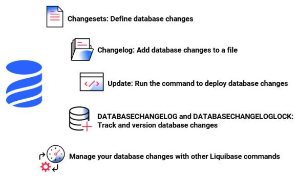

# DevOps 工具鉴宝之 Liquibase

了解 Liquibase 在数据库脚本版本管理实践中的作用、掌握基本的使用方法。

## 一、为什么数据库脚本需要纳入版本管理？

首先，让我们从头开始，假设我们有一个名为 ***Shiny*** 的项目，其主要交付项目是一个名为 ***Shiny Soft*** 的软件，该软件连接到名为 ***Shiny DB*** 的数据库。

可以简单描述此种情景的图可能看起来像这样：


现在，我们拥有我们的软件和数据库了。非常好。这很可能就是所有我们需要的东西了。

但是在大多数项目中，实际情况并不是这样子的，而是这样子的：


我们不只要处理一个环境，而是要处理**多个环境**。这提出了许多挑战。

**在代码层面，我们已经做得非常好了：**

- 代码的版本控制已普遍存在，甚至每天都可能发布更好的工具。
- 我们拥有可重复制作的版本和持续集成。
- 我们有明确定义的发布和部署流程。


**但是在数据库脚本管理层面呢？**


不幸的是，我们在此方面做得并不好。

许多项目仍然依赖手动应用的 `SQL` 脚本。有时甚至使用现场编写的 `SQL` 语句来解决问题。这会导致许多问题：

1. 该机器上的数据库当前处于什么状态？
2. 想要运行的脚本是否已经应用过了？
3. 生产中的快速修复脚本（现场编写的 `SQL` 语句等）是否已应用到测试环境中了？
4. 如何创建一个新的数据库实例？

这些问题的答案通常是：***我们不知道***。

**这个时候，我们怎么办呢？**

**_数据库脚本的版本管理_** 就是回答这些问题的好方法。

数据库脚本版本化管理之后，我们应该可以做到：

1. 所有数据库脚本入库（代码仓库，如Github、Gitlab等）管理，
2. 方便地从零开始创建新的数据库实例，
3. 随时清楚数据库当前所处的状态，
4. 确定性地从当前数据库版本迁移到新版本，
5. 无需手工执行数据库脚本变更操作，
6. 方便地回退数据库变更。

## 二、纯脚本化的数据库脚本管理方案

在介绍本次分享的主角之前，我们先循序渐进地看看纯脚本化的管理方案。

本套方案遵循的两大原则：

1. 数据库变更应该有迹可循，即在代码仓库体现所有的变更，
2. 也应该可以使用变更脚本快速还原与生产基本一致的数据库。

本着上述原则，参照平时的工作经验，设计出如下纯脚本化的数据库变更方案，供大家参考。

脚本示例可参见：[db-script-templates](https://github.com/soul-craft/db-script-templates) 。

数据库脚本目录结构如下：

- `incremental_scripts`，文件夹，存储增量的`ddl`及`dml`变更脚本。
    - `ddl`文件夹，存储增量的`ddl`变更脚本。
    - `dml`文件夹，存储增量的`dml`变更脚本。
    - `entry_scripts`文件夹，存储增量的引导变更脚本。
- `initial_scripts`，文件夹，存储初始化数据库的`ddl`及`dml`变更脚本。
    - `ddl`文件夹，存储初始化数据库的`ddl`变更脚本。
        - `functions`文件夹，存储初始化数据库的创建函数变更脚本。
        - `stored_procedures`文件夹，存储初始化数据库的创建存储过程变更脚本。
        - `tables`文件夹，存储初始化数据库的创建表变更脚本。
        - `triggers`文件夹，存储初始化数据库的创建触发器变更脚本。
        - `views`文件夹，存储初始化数据库的创建视图变更脚本。
    - `dml`文件夹，存储初始化数据库的`dml`变更脚本。
- `db_setup_all.sql`，全量建库脚本。
- `db_setup_inc.sql`，增量变更脚本。
- `db_backup_inc.sh`，增量备份脚本。
- `db_rollback_inc.sh`，增量回退脚本。

### 2.1 如何快速创建数据库新实例

使用本方案管理数据库脚本后，可以按如下方法快速创建数据库新实例：

1. 克隆示例代码到本地，

    ```Bash
    git clone https://github.com/soul-craft/db-script-templates.git
    ```

2. 切换到数据库脚本目录，

    ```Bash
    cd db-script-templates
    ```

3. 打开 MySQL 命令行工具，登录到数据库 root 用户，

    ```Bash
    mysql -uroot -p
    ```

4. 在 MySQL 工具中设置编码，可根据项目实际情况设置相应的编码，

    ```SQL
    set names utf8mb4;
    ```

5. 在 MySQL 工具中执行 `db_setup_all.sql`，

    ```SQL
    source db_setup_all.sql;
    ```

6. 检查输出信息是否存在报错，如果有报错，请根据具体情况分析和解决。

### 2.2 方案分析

1. 本方案可解决前文描述的 4 个问题中的第 4 个问题，可以快速从零开始创建一个新数据库实例，且与生产环境保持基本一致（生产环境中系统运行时新增或修改的数据除外）。

    - [ ] 1.该机器上的数据库当前处于什么状态？
    - [ ] 2.想要运行的脚本是否已经应用过了？
    - [ ] 3.生产中的快速修复脚本（现场编写的 `SQL` 语句等）是否已应用到测试环境中了？
    - [x] 4.如何创建一个新的数据库实例？

   由于没有记录脚本是否已经应用的信息，所以 1、2、3 的问题还是没有解决。

2. 前文提到的 6 个要求，也实现了其中的 1、2、5、6 条。

    - [x] 1.所有数据库脚本入库（代码仓库，如Github、Gitlab等）管理
    - [x] 2.方便地从零开始创建新的数据库实例
    - [ ] 3.随时清楚数据库当前所处的状态
    - [ ] 4.确定性地从当前数据库版本迁移到新版本
    - [x] 5.无需手工执行数据库脚本变更操作
    - [x] 6.方便地回退数据库变更

   但是还无法做到可以清楚地知道当前数据库所处的状态，也就无法确定性地完成数据库版本迁移。

## 三、通过 Liquibase 管理数据库脚本

### 3.1 Liquibase 简介

Liquibase 是一种数据库模式变更管理解决方案，它让你能够更快、更安全地在各个环境（从开发到生产）修改和发布数据库变更。

为简单起见，你可以直接使用 `SQL` 编写迁移脚本。你也可以使用与数据库无关的方式，即在 `XML`、`JSON` 或 `YAML` 文件中编写你的变更内容，这样可以实现与特定数据库的解绑。

Liquibase 使用 `SQL`、`XML`、`JSON` 或 `YAML` 格式的变更日志（ [changelog](https://docs.liquibase.com/concepts/changelogs/working-with-changelogs.html) ）文件按顺序列出数据库变更（ [changeSets](https://docs.liquibase.com/concepts/changelogs/changelog-formats.html) ）。数据库变更包含变更类型（ [Change Type](https://docs.liquibase.com/change-types/home.html) ），这是应用于数据库的操作类型，例如添加列或主键、插入、删除等等。



Liquibase 支持 6 种基本类型的命令：update、rollback、snapshot、diff、status 以及 utility。当你使用 update 命令部署你的第一个变更时，Liquibase 会检查数据库连接信息，包括用户信息、数据库 URL 和 JDBC 驱动程序等，这些信息存储在 liquibase.properties 配置文件中。

当你第一次部署变更时，Liquibase 会在你的数据库中创建两张表：[DATABASECHANGELOG](https://docs.liquibase.com/concepts/tracking-tables/databasechangelog-table.html) 和 [DATABASECHANGELOGLOCK](https://docs.liquibase.com/concepts/tracking-tables/databasechangeloglock-table.html) 。

DATABASECHANGELOG 表跟踪已部署的变更。 Liquibase 会将变更日志文件中的变更集与 DATABASECHANGELOG 跟踪表进行比较，仅部署新的变更集。

DATABASECHANGELOGLOCK 可以防止多个 Liquibase 实例同时更新数据库，确保只有一个 Liquibase 实例正在更新数据库。

Liquibase 提供了多种管理数据库变更的方法：

- 运行[命令行客户端](https://docs.liquibase.com/commands/working-with-command-parameters.html) (CLI)。

- 使用 [Liquibase Java API](https://www.liquibase.org/javadoc/) 并将 Liquibase 集成到你的应用程序中。

- 使用 [Maven](https://docs.liquibase.com/tools-integrations/maven/home.html) 、 [Spring Boot](https://docs.liquibase.com/tools-integrations/springboot/home.html) 、 [Ant](https://docs.liquibase.com/tools-integrations/ant/home.html) 、 [Jenkins](https://docs.liquibase.com/workflows/liquibase-community/using-the-jenkins-pipeline-stage-with-spinnaker.html) 、 [GitHub Actions](https://docs.liquibase.com/workflows/liquibase-community/setup-github-actions-workflow.html) 或其他 CI/CD 工具将 Liquibase 集成到你的构建过程中。

- 以 [Docker](https://docs.liquibase.com/workflows/liquibase-community/using-liquibase-and-docker.html) 容器的方式使用。

### 3.2 Liquibase 与 Flyway 的比较

Flyway 也是一个很好用的数据库脚本迁移管理的工具，支持多种数据库，支持编写 `SQL` 文件或者针对复杂的场景编写 `Java` 文件来描述变更。

那么我为什么最终会选择 Liquibase 呢？主要是基于如下几点来考虑的：

1. Flyway 社区版不支持回退，而 Liquibase 的社区版本已经支持绝大多数的回退场景。
2. Flyway 无法跨平台使用，而 Liquibase 可以使用 `XML`、`JSON` 或 `YAML` 这些不针对特定数据库的脚本来编写你的变更内容。
3. Flyway 社区版不支持 diff 模式进行差异分析，而 Liquibase 的社区版本已经支持该功能。
4. Flyway 通过固定的文件名格式来确定顺序，所以开发人员还要遵守好命名规则，例如按照日期/时间顺序命名，而 Liquibase 就是通过给定文件（主迁移文件）中指定的顺序来执行。

当然，Liquibase 的功能虽然强大，它也不是没有缺点的。为了实现数据库无关性，你必须得使用 `XML`、`JSON` 或 `YAML` 格式的文件来编写你的变更内容，要满足相应的格式要求，这就会存在一定的学习成本。

所以请各位根据自己的需求选择合适的工具。

## 四、Liquibase 实战

接下来，我们就以一个示例项目来讲一下如何使用 Liquibase。

### 4.1 开发环境

#### 4.1.1 数据库基础环境搭建

我们先讲一下开发环境的搭建。

1. 克隆示例代码到本地，

    ```Bash
    git clone https://github.com/soul-craft/liquibase-db-templates.git
    ```
   
2. 使用 IDEA 或者 VS Code 打开克隆好的项目，
3. 可以看到，`src/main/resources/init_db` 目录为按照前文提到的 *纯脚本化的数据库脚本管理方案* 编写的数据库初始化脚本，包括创建数据库、创建用户与授权等操作。
4. 接下来，将使用该脚本创建数据库，
5. 切换到初始化数据库脚本目录，

    ```Bash
    cd liquibase-db-templates/src/main/resources/init_db
    ```

6. 打开 MySQL 命令行工具，登录到数据库 root 用户，

    ```Bash
    mysql -uroot -p
    ```

7. 在 MySQL 工具中设置编码，可根据项目实际情况设置相应的编码，

    ```SQL
    set names utf8mb4;
    ```

8. 在 MySQL 工具中执行 `db_setup_all.sql`

    ```SQL
    source db_setup_all.sql;
    ```

9. 检查输出信息是否存在报错，如果有报错，请根据具体情况分析和解决。

创建好数据库后，可以以此为基础执行数据库变更了。 如果是开发环境，可以使用Maven（本文采用的Maven）、Gradle执行数据库变更；如果是生产环境，可以使用编译打包后的制品，结合 Liquibase 软件执行数据库变更。

#### 4.1.2 环境配置

1. 使用 IDEA 或者 VS Code 打开克隆好的项目，
2. 打开 pom.xml 文件，可以看到，我们添加了 `MySQL` 的驱动依赖，各位可以自行选择合适的驱动版本，

    ```xml
    <dependencies>
        <dependency>
            <groupId>mysql</groupId>
            <artifactId>mysql-connector-java</artifactId>
            <version>8.0.25</version>
        </dependency>
    </dependencies>
    ```

3. 添加了 `liquibase-maven-plugin` 插件，
    ```xml
   <plugin>
        <groupId>org.liquibase</groupId>
        <artifactId>liquibase-maven-plugin</artifactId>
        <version>4.3.1</version>
        <configuration>
            <propertyFile>target/classes/liquibase.properties</propertyFile>
            <outputChangeLogFile>target/changelog.xml</outputChangeLogFile>
        </configuration>
    </plugin>
    ```
   其中 `propertyFile` 指定 `Maven` 编译后的 liquibase.properties 配置文件路径，`outputChangeLogFile` 指定的是从存量数据库生成数据库变更脚本时的输出文件路径，此配置项不是必须的。

4. 示例工程为了区分开发环境与生产环境，添加了 profile，并且默认启用的是开发环境，即 `dev` ，
    ```xml
    <profiles>
        <profile>
            <id>dev</id>
            <properties>
                <profiles.active>dev</profiles.active>
            </properties>
            <activation>
                <activeByDefault>true</activeByDefault>
            </activation>
        </profile>
        <profile>
            <id>prod</id>
            <properties>
                <profiles.active>prod</profiles.active>
            </properties>
        </profile>
    </profiles>
    ```
   并在 <build> 节点指定了资源相关的配置：
    ```xml
    <resources>
        <resource>
            <directory>src/main/resources</directory>
            <excludes>
                <exclude>profiles/**/*</exclude>
            </excludes>
        </resource>
        <resource>
            <directory>src/main/resources/profiles/${profiles.active}</directory>
        </resource>
    </resources>
    ```
   
5. 打开 `liquibase.properties` 配置文件，可以看到，

    ```properties
    changeLogFile=db/changelog/changelog-master.xml
    url=jdbc:mysql://localhost:3306/liquibase_test
    username=liquibase
    password=liquibase
    driver=com.mysql.cj.jdbc.Driver
    classpath=dependency/mysql-connector-java-8.0.25.jar
    liquibase.hub.mode=off
    logLevel=INFO
    logFile=liquibase.log
    ```
    其中，

    1. `changeLogFile` 指定主引导文件路径，在此文件中指定了所有的数据库变更操作脚本，以及相应的执行顺序（从上到下依次执行），
   
    2. `url`，`username`，`password`，`driver`，指定数据库相关的配置，包括链接URL、用户名、密码及驱动类名，

    3. `classpath` 指定`MySQL`驱动的位置，由于我们将驱动打包到了 dependency 目录，所以这里指定的是 `dependency/mysql-connector-java-8.0.25.jar`，

    4. `liquibase.hub.mode`，指定是否将数据发往 liquibase 以供其分析，示例选择不使用，

    5. `logLevel`，`logFile`，指定日志相关的配置。

6. 以上就是 `Maven`、`Liquibase` 相关的配置信息。

#### 4.1.3 代码结构

接下来，我们讲一下 liquibase 变更脚本的结构及一些简单的使用方法。

1. 主引导文件，
   ```xml
   <?xml version="1.0" encoding="UTF-8"?>
   <databaseChangeLog xmlns="http://www.liquibase.org/xml/ns/dbchangelog"
                      xmlns:xsi="http://www.w3.org/2001/XMLSchema-instance" xsi:schemaLocation="http://www.liquibase.org/xml/ns/dbchangelog
       http://www.liquibase.org/xml/ns/dbchangelog/dbchangelog-3.8.xsd">
       <include file="db/changelog/tag_initialize.xml"/>
       <include file="db/changelog/20210308_001/add_person_table.xml"/>
       <include file="db/changelog/20210308_001/add_person_records.xml"/>
       <include file="db/changelog/20210308_001/tag_20210308.xml"/>
       <include file="db/changelog/20210309_001/create_people_view.xml"/>
       <include file="db/changelog/20210309_001/tag_20210309.xml"/>
   </databaseChangeLog>
   ```
   可以看到，节点 `databaseChangeLog` 即为前文提到的 _**变更日志（ changelog ）**_。该文件中将其他变更文件包含了进来，并指定了他们执行的顺序。其中，
   1. `tag_initialize.xml`，`tag_20210308.xml`，`tag_20210309.xml` 给数据库打标签，
   2. `add_person_table.xml` 新增 `person` 表，
   3. `add_person_records.xml` 往 `person` 表中添加记录，
   4. `create_people_view.xml` 创建 `people` 视图。

2. 给数据库打标签，以 `tag_initialize.xml` 为例，
   ```xml
   <?xml version="1.0" encoding="UTF-8"?>
   <databaseChangeLog xmlns="http://www.liquibase.org/xml/ns/dbchangelog"
                      xmlns:xsi="http://www.w3.org/2001/XMLSchema-instance" xsi:schemaLocation="http://www.liquibase.org/xml/ns/dbchangelog
       http://www.liquibase.org/xml/ns/dbchangelog/dbchangelog-3.8.xsd">
       <changeSet id="initialize_001_1" author="scott">
           <tagDatabase tag="version_initialize" />
       </changeSet>
   </databaseChangeLog>
   ```
   1. 节点 `changeSet` 即为前文提到的 ***数据库变更（ changeSets ）*** 。属性 `id` 指定变更的唯一ID，`author` 属性指定变更的作者。它的子节点可以指定各种各样的变更类型（ [Change Type](https://docs.liquibase.com/change-types/home.html) ）。
   2. 节点 `tagDatabase` 即为前文提到的 **_变更类型（ Change Type ）_** 之一的 **给数据库打标签**。该标签可用于之后的回退功能，作为一个回退点。 `tag` 属性指定标签的名称。详细信息可参见：[tagDatabase](https://docs.liquibase.com/change-types/tag-database.html) 。
3. 新增表，
   ```xml
   <?xml version="1.0" encoding="UTF-8"?>
   <databaseChangeLog xmlns="http://www.liquibase.org/xml/ns/dbchangelog"
                      xmlns:xsi="http://www.w3.org/2001/XMLSchema-instance" xsi:schemaLocation="http://www.liquibase.org/xml/ns/dbchangelog
       http://www.liquibase.org/xml/ns/dbchangelog/dbchangelog-3.8.xsd">
       <changeSet id="20210308_001_1" author="scott">
           <createTable tableName="person" remarks="Person">
               <column name="id" type="int">
                   <constraints primaryKey="true" nullable="false"/>
               </column>
               <column name="name" type="varchar(100)">
                   <constraints nullable="false"/>
               </column>
           </createTable>
       </changeSet>
   </databaseChangeLog>
   ```
   1. 节点 `createTable` 即为前文提到的 **_变更类型（ Change Type ）_** 之一的 **创建表**。`tableName` 指定表的名称，`remarks` 指定表的描述信息。详细信息可参见：[createTable](https://docs.liquibase.com/change-types/create-table.html) 。
   2. `column` 节点指定表的列，列的顺序为从上往下依次排列。`id` 指定列的名称，`type` 指定列的类型。
   3. `column` 节点中的 `constraints` 子节点指定列的约束信息，如主键约束、非空约束等。
   4. 想要更多较为复杂的功能，可以参见官方文档：[Columns](https://docs.liquibase.com/concepts/changelogs/attributes/column.html) 。
4. 往表中添加记录，
   ```xml
   <?xml version="1.0" encoding="UTF-8"?>
   <databaseChangeLog xmlns="http://www.liquibase.org/xml/ns/dbchangelog"
                      xmlns:xsi="http://www.w3.org/2001/XMLSchema-instance" xsi:schemaLocation="http://www.liquibase.org/xml/ns/dbchangelog
       http://www.liquibase.org/xml/ns/dbchangelog/dbchangelog-3.8.xsd">
       <changeSet id="20210308_001_2" author="scott">
           <insert tableName="person">
               <column name="id" value="1"/>
               <column name="name" value="Scott"/>
           </insert>
           <insert tableName="person">
               <column name="id" value="2"/>
               <column name="name" value="Jeniffer"/>
           </insert>
           <rollback>delete from person where id = 1 or id = 2</rollback>
       </changeSet>
   </databaseChangeLog>
   ```
   1. 节点 `insert` 即为前文提到的 **_变更类型（ Change Type ）_** 之一的 **插入数据**。属性 `tableName` 指定插入的表名。详细信息可参见：[insert](https://docs.liquibase.com/change-types/insert.html) 。
   2. `column` 节点指定插入列的名称（`name` 属性）与对应的值（`value` 属性）。
   3. 也可在 `changeSet` 中用 `rollback` 节点指定自定义的回退脚本（如果不指定，一些变更类型也会自动生成相应的回退脚本，具体信息可参见：[auto rollback](https://docs.liquibase.com/workflows/liquibase-community/liquibase-auto-rollback.html) ）。
5. 创建视图
   ```xml
   <?xml version="1.0" encoding="UTF-8"?>
   <databaseChangeLog xmlns="http://www.liquibase.org/xml/ns/dbchangelog"
                      xmlns:xsi="http://www.w3.org/2001/XMLSchema-instance" xsi:schemaLocation="http://www.liquibase.org/xml/ns/dbchangelog
       http://www.liquibase.org/xml/ns/dbchangelog/dbchangelog-3.8.xsd">
       <changeSet id="20210309_001_1" author="scott">
           <createView viewName="people" replaceIfExists="true" remarks="A simple view for person">
               select id, name from person
           </createView>
       </changeSet>
   </databaseChangeLog>
   ```
   1. 节点 `createView` 即为前文提到的 **_变更类型（ Change Type ）_** 之一的 **创建视图**。详细信息可参见：[createView](https://docs.liquibase.com/change-types/create-view.html) 。
   2. 其中，属性 `viewName` 指定视图的名称，属性 `replaceIfExists` 标识是否替换原有的视图，属性 `remarks` 指定视图的描述信息。
   3. 节点的内容则指定视图的具体`SQL`语句。

#### 4.1.4 打包运行

接下来，我们讲一下开发环境中 liquibase 的打包及运行方法。我们以命令行及界面操作两种方式进行讲解。

##### 4.1.4.1 命令行操作

1. 编译打包，可使用如下命令打包，其中 `-P dev` 指定使用 `dev` 的 Profile（即开发环境的配置信息，下同），
   ```Bash
   mvn -P dev clean package
   ```
2. 生成变更脚本，检查变更脚本，
   ```Bash
   mvn -P dev liquibase:updateSQL
   ```
   生成的变更脚本位于 `target/liquibase/migrate.sql`，可检查一下看看脚本是否存在问题。
3. 如果检查没有问题，则可使用如下命令执行变更，
   ```Bash
   mvn -P dev liquibase:update
   ```
4. 运行完后可以检查数据库对象是否存在问题，同时检查一下`DATABASECHANGELOG`表中的记录是否存在异常。
   1. 可以看到，`person`表和`people`视图已经创建成功，并已插入相应记录，所有变更脚本均已执行成功，并记录到了`DATABASECHANGELOG`表中。 
   ```mysql
   mysql> desc person;
   +-------+--------------+------+-----+---------+-------+
   | Field | Type         | Null | Key | Default | Extra |
   +-------+--------------+------+-----+---------+-------+
   | id    | int          | NO   | PRI | NULL    |       |
   | name  | varchar(100) | NO   |     | NULL    |       |
   +-------+--------------+------+-----+---------+-------+
   2 rows in set (0.01 sec)
   
   mysql> desc people;
   +-------+--------------+------+-----+---------+-------+
   | Field | Type         | Null | Key | Default | Extra |
   +-------+--------------+------+-----+---------+-------+
   | id    | int          | NO   |     | NULL    |       |
   | name  | varchar(100) | NO   |     | NULL    |       |
   +-------+--------------+------+-----+---------+-------+
   2 rows in set (0.01 sec)
   
   mysql> desc people;
   +-------+--------------+------+-----+---------+-------+
   | Field | Type         | Null | Key | Default | Extra |
   +-------+--------------+------+-----+---------+-------+
   | id    | int          | NO   |     | NULL    |       |
   | name  | varchar(100) | NO   |     | NULL    |       |
   +-------+--------------+------+-----+---------+-------+
   2 rows in set (0.01 sec)
   
   mysql> select ID,AUTHOR,FILENAME,EXECTYPE,MD5SUM,TAG from DATABASECHANGELOG;
   +------------------+--------+--------------------------------------------------+----------+------------------------------------+--------------------+
   | ID               | AUTHOR | FILENAME                                         | EXECTYPE | MD5SUM                             | TAG                |
   +------------------+--------+--------------------------------------------------+----------+------------------------------------+--------------------+
   | initialize_001_1 | scott  | db/changelog/tag_initialize.xml                  | EXECUTED | 8:20839215b888a482d78980d3680a5672 | version_initialize |
   | 20210308_001_1   | scott  | db/changelog/20210308_001/add_person_table.xml   | EXECUTED | 8:fc29dbddad05fc9d3de7527a1d0a7620 | NULL               |
   | 20210308_001_2   | scott  | db/changelog/20210308_001/add_person_records.xml | EXECUTED | 8:207c0b7f49daa4351f3c3904849c0089 | NULL               |
   | 20210308_001_3   | scott  | db/changelog/20210308_001/tag_20210308.xml       | EXECUTED | 8:3d747dd0d240064cae07d99897faf13d | version_20210308   |
   | 20210309_001_1   | scott  | db/changelog/20210309_001/create_people_view.xml | EXECUTED | 8:ed3f61f89e77083a84f7355a25f02867 | NULL               |
   | 20210309_001_2   | scott  | db/changelog/20210309_001/tag_20210309.xml       | EXECUTED | 8:ea3c9f45c8b2d7cb175e400e66210a99 | version_20210309   |
   +------------------+--------+--------------------------------------------------+----------+------------------------------------+--------------------+
   6 rows in set (0.00 sec)
   ```

5. 如果存在问题，需要回退变更，可以回退到指定的标签位置，例如，如果想要回退到标签 `version_20210308` 所处位置（标签 `version_20210308` 之后的变更将全部丢失，即创建 `version_20210309`和`version_20210308`标签以及`people` 视图的操作将被回退），可执行如下操作：
   1. 生成回退脚本，并检查，
       ```Bash
       mvn -P dev liquibase:rollbackSQL -Dliquibase.rollbackTag=version_20210308
       ```
      生成的回退脚本位于 `target/liquibase/migrate.sql`，可检查一下看看脚本是否存在问题。
   2. 执行回退，
       ```Bash
       mvn -P dev liquibase:rollback -Dliquibase.rollbackTag=version_20210308
       ```
   3. 检查回退是否成功，可以看到 `people` 视图已被删除，标签 `version_20210309` 和 `version_20210308` 已不存在。
       ```mysql
       mysql> select ID,AUTHOR,FILENAME,EXECTYPE,MD5SUM,TAG from DATABASECHANGELOG;
       +------------------+--------+--------------------------------------------------+----------+------------------------------------+--------------------+
       | ID               | AUTHOR | FILENAME                                         | EXECTYPE | MD5SUM                             | TAG                |
       +------------------+--------+--------------------------------------------------+----------+------------------------------------+--------------------+
       | initialize_001_1 | scott  | db/changelog/tag_initialize.xml                  | EXECUTED | 8:20839215b888a482d78980d3680a5672 | version_initialize |
       | 20210308_001_1   | scott  | db/changelog/20210308_001/add_person_table.xml   | EXECUTED | 8:fc29dbddad05fc9d3de7527a1d0a7620 | NULL               |
       | 20210308_001_2   | scott  | db/changelog/20210308_001/add_person_records.xml | EXECUTED | 8:207c0b7f49daa4351f3c3904849c0089 | NULL               |
       +------------------+--------+--------------------------------------------------+----------+------------------------------------+--------------------+
       3 rows in set (0.00 sec)
      
       mysql> desc people;
       ERROR 1146 (42S02): Table 'liquibase_test.people' doesn't exist
       ```

##### 4.1.4.2 界面操作

1. 编译打包

   界面中选择 Maven 插件，首先确认 Profiles 选择的是 **dev**，然后再展开 Lifecycle节点，先双击 clean 清空项目临时编译结果，再双击 package 进行重新编译和打包。
2. 生成变更脚本，检查变更脚本
   
   在 Maven 插件中展开 liquibase 插件，双击 `liquibase:updateSQL`，生成的变更脚本位于 `target/liquibase/migrate.sql`，可检查一下看看脚本是否存在问题。
3. 执行变更

   在 Maven 插件中展开 liquibase 插件，双击 `liquibase:update`，即会执行变更。
4. 运行完后可以检查数据库对象是否存在问题，同时检查一下`DATABASECHANGELOG`表中的记录是否存在异常。
5. 由于回退操作需要加入参数，故回退变更建议执行命令行操作，可参考上一章节的命令行操作。

### 4.2 生产环境

接下来，我们讲一下如果在生产环境中运行打包后的数据库变更脚本。

1. 下载 liquibase 软件

   可打开链接 https://www.liquibase.org/download 下载该软件，本文使用的 liquibase 版本为 `4.10.0` 。
2. 配置环境变量
   1. 将 liquibase 安装路径下的 bin 目录加入到环境变量 `PATH` 中去，确保在任意目录可以执行 `liquibase` 命令。
   2. 在任意目录打开命令行工具，输入 `liquibase --version` 检查版本信息，如正常返回，则代表安装正常。
       ```shell
       liquibase-db-templates % liquibase --version
       ####################################################
       ##   _     _             _ _                      ##
       ##  | |   (_)           (_) |                     ##
       ##  | |    _  __ _ _   _ _| |__   __ _ ___  ___   ##
       ##  | |   | |/ _` | | | | | '_ \ / _` / __|/ _ \  ##
       ##  | |___| | (_| | |_| | | |_) | (_| \__ \  __/  ##
       ##  \_____/_|\__, |\__,_|_|_.__/ \__,_|___/\___|  ##
       ##              | |                               ##
       ##              |_|                               ##
       ##                                                ## 
       ##  Get documentation at docs.liquibase.com       ##
       ##  Get certified courses at learn.liquibase.com  ## 
       ##  Free schema change activity reports at        ##
       ##      https://hub.liquibase.com                 ##
       ##                                                ##
       ####################################################
       Starting Liquibase at 11:27:06 (version 4.10.0 #2501 built at 2022-05-04 14:27+0000)
       Running Java under /Library/Java/JavaVirtualMachines/jdk1.8.0_251.jdk/Contents/Home/jre (Version 1.8.0_251)
   
       Liquibase Version: 4.10.0
       Liquibase Community 4.10.0 by Liquibase
       ```
3. 在开发环境打包版本包，可使用如下命令打包，其中 `-P prod` 指定使用 `prod` 的 Profile（即生产环境的配置信息，下同），
   ```Bash
   mvn -P prod clean package
   ```
   打包后的版本包位于 `target/liquibase-db-templates-1.0-SNAPSHOT.jar`，具体版本号信息（`1.0-SNAPSHOT`）可能会有些出入。
4. 解压缩版本包
   1. 将版本包复制到生产环境任意目录，
   2. 创建临时目录，
      ```Bash
      mkdir 1.0-SNAPSHOT
      ```
   3. 解压缩版本包到刚创建的临时目录，
      ```Bash
      tar -xvf liquibase-db-templates-1.0-SNAPSHOT.jar -C 1.0-SNAPSHOT
      ```
5. 检查（修改）配置文件，配置文件位于刚刚创建的临时目录之下，文件名为 `liquibase.properties`，

   可以检查其中的配置信息是否准确，如果不准确可以进行适当修改。
6. 生成变更脚本，检查变更脚本
   1. 切换到刚创建的临时目录
      ```Bash
      cd 1.0-SNAPSHOT
      ```
   2. 执行如下命令生成变更脚本，生成的脚本输出在控制台，
      ```Bash
      liquibase update-sql
      ```
   3. 检查变更脚本是否存在问题
7. 执行变更
   
   如果变更脚本没有问题，则执行如下命令，执行变更，
   ```Bash
   liquibase update
   ```
8. 运行完后可以检查数据库对象是否存在问题，可参照命令行操作一节，
9. 如果存在问题，需要回退变更，可以回退到指定的标签位置，例如，如果想要回退到标签 `version_20210308` 所处位置（标签 `version_20210308` 之后的变更将全部丢失，即创建 `version_20210309`和`version_20210308`标签以及`people` 视图的操作将被回退），可执行如下操作：
   1. 生成回退脚本，生成的脚本输出在控制台，
       ```Bash
       liquibase rollback-sql --tag=version_20210308
       ```
   2. 检查变更脚本是否存在问题，
   3. 如果脚本没有问题，则执行回退脚本，
       ```Bash
       liquibase rollback --tag=version_20210308
       ```
   4. 检查回退是否成功，可以看到 `people` 视图已被删除，标签 `version_20210309` 和 `version_20210308` 已不存在。
       ```mysql
       mysql> select ID,AUTHOR,FILENAME,EXECTYPE,MD5SUM,TAG from DATABASECHANGELOG;
       +------------------+--------+--------------------------------------------------+----------+------------------------------------+--------------------+
       | ID               | AUTHOR | FILENAME                                         | EXECTYPE | MD5SUM                             | TAG                |
       +------------------+--------+--------------------------------------------------+----------+------------------------------------+--------------------+
       | initialize_001_1 | scott  | db/changelog/tag_initialize.xml                  | EXECUTED | 8:20839215b888a482d78980d3680a5672 | version_initialize |
       | 20210308_001_1   | scott  | db/changelog/20210308_001/add_person_table.xml   | EXECUTED | 8:fc29dbddad05fc9d3de7527a1d0a7620 | NULL               |
       | 20210308_001_2   | scott  | db/changelog/20210308_001/add_person_records.xml | EXECUTED | 8:207c0b7f49daa4351f3c3904849c0089 | NULL               |
       +------------------+--------+--------------------------------------------------+----------+------------------------------------+--------------------+
       3 rows in set (0.00 sec)
      
       mysql> desc people;
       ERROR 1146 (42S02): Table 'liquibase_test.people' doesn't exist
       ```

### 4.3 Liquibase 方案思考

至此，已演示完 Liquibase 常用的一些基础功能。下面就该方面做一些思考：

1. 该方案解决了前文描述的 4 个问题中的 1、2、4：

    - [x] 1.该机器上的数据库当前处于什么状态？
    - [x] 2.想要运行的脚本是否已经应用过了？
    - [ ] 3.生产中的快速修复脚本（现场编写的 SQL 语句等）是否已应用到测试环境中了？
    - [x] 4.如何创建一个新的数据库实例？

   针对第 3 个问题，根本解决方案应该是 ***杜绝在生产环境中手工执行变更***，任何变更应该先经过测试，然后提交到代码仓库，最后由自动化脚本执行变更。

2. 前文提到的 6 个要求，该方案可以全部满足：

    - [x] 1.所有数据库脚本入库（代码仓库，如Github、Gitlab等）管理，
    - [x] 2.方便地从零开始创建新的数据库实例，
    - [x] 3.随时清楚数据库当前所处的状态，
    - [x] 4.确定性地从当前数据库版本迁移到新版本，
    - [x] 5.无需手工执行数据库脚本变更操作，
    - [x] 6.方便地回退数据库变更。

   注：回退功能某些场景需要 Liquibase 的 **_商用_** 版本。

## 五、参考资料

- Liquibase 官网: https://www.liquibase.org/
- Flyway 官网: https://flywaydb.org/
- 纯脚本化管理方案示例代码: https://github.com/soul-craft/db-script-templates
- Liquibase 管理方案示例代码: https://github.com/soul-craft/liquibase-db-templates
