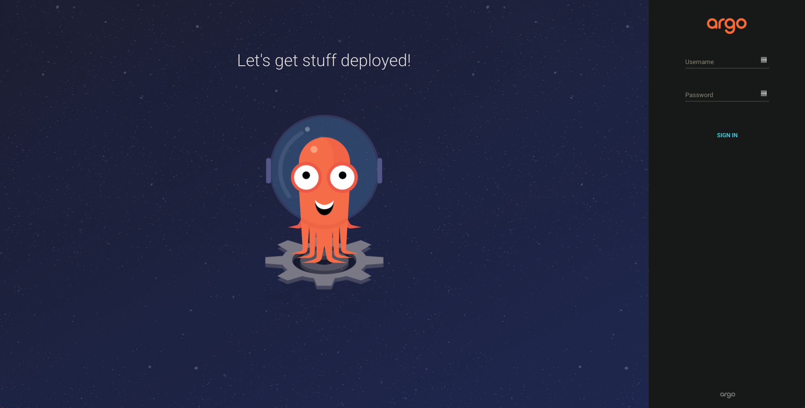

# 1. ArgoCD 简介

基于 kubernetes 的声明式 Gitops 持续部署工具。

持续部署工具有很多，如 Jenkins 等等，我们为什么选择 ArgoCD 呢？

1. 应用定义，配置和环境变量管理等等，都是声明式的，基于云原生的。
2. 所有声明清单都存储在代码仓库中，受版本管理
3. 应用发布和生命周期管理都是自动化的，可审计的。

最重要的，ArgoCD 操作简单，非常易用。

# 2. 工作原理


ArgoCD 被设计并实现为 Kubernetes 控制器，它会持续监控 ArgoCD 应用状态。ArgoCD 中的应用会对应一个 Git 仓库，ArgoCD 控制器确保应用状态始终同步。此处的 Git 仓库，并不存放项目源码，它保存的是项目在 Kubernetes 中的运行状态，也就是配置清单。Git 仓库内容的组织形式，支持 Helm, Kustomize 等；

当用户向 Git 仓库提交合并请求，合并被受理后，Git 仓库中应用状态的配置清单发生变化，此时 Git 仓库可以通过 WebHook 触发 ArgoCD 的应用同步。如果未配置 WebHook，ArgoCD 会轮询检测 Git 仓库的变更，检测周期默认为 3 分钟。当然，用户也可以通过 UI 或 CLI 的方式手动触发应用同步。

ArgoCD 的 Hook 机制，会在应用状态同步前，同步中，同步后及同步失败后，触发响应的钩子方法，用来完成一些额外操作，可以实现更加复杂的应用控制。ArgoRollouts 的蓝绿发布，就非常好的利用了 hooks 机制。

ArgoCD 不仅可以将应用发布到它所在的 Kubernates 集群，它也可以托管其他集群，实现多集群的应用部署。该功能由 ApplicationSet 实现。

# 3. 安装 ArgoCD

> [k8s 集群部署参考文档](install-k8s-cluster.md)

推荐用 operator 的方式部署 ArgoCD。推荐理由如下：

- 使用默认配置快速安装并启动 ArgoCD
- 无缝升级 ArgoCD 所有组件
- 支持定期计划备份和恢复 ArgoCD 集群
- 聚合并发布 ArgoCD 及 Operator 本身的指标，供 Prometheus 和 Grafana 使用
- 根据需要自动缩放对应组件

## 3.1 安装 ArgoCD Operator

> ref: https://operatorhub.io/operator/argocd-operator

```shell

curl -sL https://github.com/operator-framework/operator-lifecycle-manager/releases/download/v0.21.2/install.sh | bash -s v0.21.2

kubectl create -f https://operatorhub.io/install/argocd-operator.yaml

kubectl get csv -n operators
```

> !!! 注: 如果不配置环境变量，则 ArgoCD 无法创建 Namespace

> ref: https://github.com/argoproj/argo-cd/issues/5886

默认使用 Operator 部署的 ArgoCD，没有集群资源的控制权限；找到 `Subscription` 类型的资源，给 Operator 添加环境变量配置；

```yaml
apiVersion: operators.coreos.com/v1alpha1
kind: Subscription
metadata:
  name: argocd
  namespace: argocd
spec:
  channel: alpha
  name: argocd-operator
  source: operatorhubio-catalog
  sourceNamespace: olm
  config:
    env:
      - name: ARGOCD_CLUSTER_CONFIG_NAMESPACES
        value: <argocd-namespaces(s)>
# 此处案例中 value 配置为 argocd
```

## 3.2 创建 ArgoCD 实例

> https://argocd-operator.readthedocs.io/en/latest/usage/ingress/

```yaml
apiVersion: argoproj.io/v1alpha1
kind: ArgoCD
metadata:
  name: monday-argocd
  namespace: argocd
spec:
  server:
    insecure: true
    ingress:
      enabled: true
```

## 3.3 修改配置导出服务

ArgoCD Operator 默认 Ingress 域名为资源名，此处即为 `monday-argocd`。Operator 官方文档中说可以 `overwrite` 域名，但翻遍了 CRD 的描述信息，也没找到。翻源码才发现 Operator 并没有控制 `host` 字段。直接 `kubectl edit` 即可 @\_@

> !!! 注：官方文档言辞模糊，竟然可以直接修改

> ingress 域名: argo.monday.fun

本地主机配置 hosts 如下:

```shell
# /etc/hosts

10.10.14.91 argo.monday.fun
```

> > 看到下图请为自己鼓掌 !!!



# 3.4. 获取登录密码

> 默认 admin 密码存放在 `<ArgoCD 实例名>-cluster` secret 里

```shell

kubectl -n argocd get secret monday-argocd-cluster -o jsonpath='{.data.admin\.password}' | base64 -d
```

# 4. 部署样例仓库

> ref: https://github.com/argoproj/argocd-example-apps.git

可以通过 UI 界面或者直接 `kubectl apply` 下方配置清单，创建 ArgoCD 应用清单。

```yaml
apiVersion: argoproj.io/v1alpha1
kind: Application
metadata:
  name: guestbook
spec:
  destination:
    name: ""
    namespace: guestbook
    server: "https://kubernetes.default.svc"
  source:
    path: kustomize-guestbook
    repoURL: "https://github.com/argoproj/argocd-example-apps.git"
    targetRevision: HEAD
  project: default
  syncPolicy:
    automated:
      prune: true
      selfHeal: true
    syncOptions:
      - CreateNamespace=true
```

> 常见问题: Namespace "guestbook" for Service "guestbook-helm-guestbook" is not managed

> !!! 注: 这个问题就是 3.1 步骤中没有添加环境导致的

```shell
# 通过给 Namespace 打标签的方式，给 ArgoCD 授权
# 默认情况下 $NAMESPACE=argocd
kubectl label ns guestbook argocd.argoproj.io/managed-by=$NAMESPACE
```

上述配置清单也可以通过 UI 界面生成，具体操作见下图:


# 5. app-of-apps 模式

在 argocd 中，用户所管理的对象，叫做应用。应用的状态，由它对应的资源清单描述。我们可以创建一个仓库，集中管理这些应用配置清单，而这个仓库，也可以当做应用来看待。

这种模式，就是 app of apps 模式。

> https://github.com/argoproj/argocd-example-apps/tree/master/apps

官方示例中，使用 Helm Chart 来实现 app of apps 模式，templates 目录下每个文件都是一个 ArgoCD Application 配置清单。

```text
├── Chart.yaml
├── templates
│   ├── guestbook.yaml
│   ├── helm-dependency.yaml
│   ├── helm-guestbook.yaml
│   └── kustomize-guestbook.yaml
└── values.yaml
```

当我们删除 app of apps 应用时，对应的其他应用，也会被级联删除。

## 5.1 应用场景

1. 集群应用迁移

微服务开发模式中，一个项目往往对应多个子项目。我们可以为创建 app of apps 应用，管理项目的微服务。当项目需要迁移时，只需要在新集群或者新 Namespace 中应用即可。

2. 集群初始化

生产环境中，k8s 集群部署好后，还会安装一些必要的支撑服务应用。此时可以把集群的初始化工作，使用 app of apps 应用描述。这样，新集群的初始化工作，也仅仅是创建个 argocd 应用而已。

## 5.2 俄罗斯套娃模式

在容器云原生的世界里，俄罗斯套娃模式很常见。例如，docker in docker，k8s in k8s。我们刚讲过的 app of apps 也是类似套娃模式。我们是否可以再套一层呢？

答案是肯定的。app of apps 应用，本质上仍然是 argocd Application，我们依旧可以将它放在更上层的 app of apps 应用中。

这里的想象空间就有点过于复杂了，这里仅仅给大家提供一种思考的方向，目前还没有听说哪个团队这么实践过。

# 6. ArgoCD 添加多集群

ArgoCD 在 Web UI 界面上无法添加 Kubernetes 集群，目前仅支持通过 argocd 命令行客户端工具；

## 6.1 安装 argocd 命令行客户端工具

```shell
# ref: https://argo-cd.readthedocs.io/en/stable/cli_installation/

curl -sSL -o /usr/local/bin/argocd https://github.com/argoproj/argo-cd/releases/latest/download/argocd-linux-amd64
chmod +x /usr/local/bin/argocd
```

## 6.2 添加集群方法一

argocd 命令行客户端，提供 cluster add 方法，可以从 kubectl 的连接上下文或者认证文件中添加集群信息。
当我们在 kubectl 的上下文中，添加 tuesday 集群的上下文后，就可以使用 argocd cluster add 命令了；

```shell
# 拷贝 Tuesday 集群的认证秘钥到
scp 10.10.15.153:~/.kube/config  ~/.kube/tuesday.config

# 通过环境变量配置 kubectl
export KUBECONFIG=$HOME/.kube/config:$HOME/.kube/tuesday.config

# 查看 kubectl 上下文
kubectl config get-contexts

CURRENT   NAME                               CLUSTER           AUTHINFO           NAMESPACE
*         kubernetes-admin@cluster.monday    cluster.monday    kubernetes-admin
          kubernetes-admin@cluster.tuesday   cluster.tuesday   kubernetes-admin

# 导出 argocd-server 443 服务
kubectl port-forward svc/monday-argocd-server -n argocd 9999:443

# 登录 argocd，输入 admin 账号密码
argocd login 127.0.0.1:9999

# 通过 kubeconfig 添加集群
argocd cluster add kubernetes-admin@cluster.tuesday

# optional: 也可以不配置 kubectl 而直接通过 Kubeconfig 文件添加集群
argocd cluster add --kubeconfig tuesday.config --name tuesday kubernetes-admin@cluster.tuesday
```

## 6.3 添加集群方法二

argocd-cli 客户端支持从 kubeconfig 文件直接添加集群信息；

```shell
$ argocd cluster add --kubeconfig tuesday.config

ERRO[0000] Choose a context name from:
CURRENT  NAME                              CLUSTER          SERVER
*        kubernetes-admin@cluster.tuesday  cluster.tuesday  https://tuesday-api.automan.fun:6443

$ argocd cluster add --kubeconfig tuesday.config kubernetes-admin@cluster.tuesday
```

## 6.4 查看集群列表

```shell
# 查看集群列表
argocd cluster list

SERVER                                NAME        VERSION  STATUS   MESSAGE
https://tuesday-api.automan.fun:6443  tuesday              Unknown  Cluster has no application and not being monitored.
https://kubernetes.default.svc        in-cluster           Unknown  Cluster has no application and not being monitored.
```

> 由于 ArgoCD 并未在集群中部署应用，所以对集群的健康检查是关闭的。

# 7. ApplicationSet

说到 ArgoCD 多集群部署应用，首先想到的方案可能在 UI 界面上配置多个应用，选择不同的集群发布即可；其次还可能想到，针对不同集群，写不同的 Application 配置清单，直接 `kubectl apply` 即可；我们不能说上述的两种方法不能用，但绝对不符合程序员对优雅的审美。程序员的优雅到底是有多优雅呢？ ArgoCD 官方用一个子项目给出了答案。这个项目，就是我们今天要讲的 ArgoCD ApplicationSet。

当然跨集群部署应用，只是 ApplicationSet 的功能之一。我们将全面地把它讲透。

顾名思义，ApplicationSet 就是 Application 的集合，它控制器和相应的 CRD 构成。

## 7.1 ArgoCD 添加 ApplicationSet 控制器

只需在 ArgoCD CR 资源中添加 applicationSet 字段即可。

```shell
apiVersion: argoproj.io/v1alpha1
kind: ArgoCD
metadata:
  name: monday-argocd
  namespace: argocd
spec:
  version: v2.3.4
  server:
    insecure: true
    ingress:
      enabled: true
  applicationSet: {}  # 增加
```

## 7.2 ApplicationSet 特性

针对于跨集群部署应用和 monorepo，ApplicationSet 这个 CRD 可以实现自动化和更大的灵活性。

官方给出四个特性：

1. 使用单个 ApplicationSet 配置清单控制多个 kubernetes 集群的能力
2. 使用单个 ApplicationSet 配置清单从一个或多个 Git 存储仓库部署多个应用程序
3. 在多租户集群中，提高单个集群租户使用 ArgoCD 部署应用程序的能力。无需让特权集群管理员参与启用目标集群或命名空间。假如我们有 A B 两个集群，通过 ApplicationSet，A 集群中的租户，不需要拥有 B 集群的权限，就可以在 B 集群中发布应用。这样就可以把持续发布的权限提前，放到持续集成阶段管理。
4. 增强对 monorepo 的支持

> monorepo： 单个 Git 仓库中定义多个 ArgoCD 应用程序资源

一个项目常常由多个微服务构成，这些微服务的部署配置清单，可以放到各自独立的仓库中，也可以化零为整，在同一个仓库中管理。独立仓库管理，对单个微服务开发团队来说，可以更方便发版和回滚，但对于整个项目来说，高灵活度会带来不稳定性。ArgoCD 则推荐使用 MonoRepo 的方式，统一管理微服务的配置。原因也很简单，统一管理能更好的控制各微服务之间的依赖关系，从而提高整个项目的稳定性。

## 7.3 工作原理

当创建，更新或删除 ApplicationSet CRD 资源时，ApplicationSet 控制器会通过创建，更新或删除一个或多个对应的 ArgoCD Application 资源来响应。

实际上，ApplicationSet 的唯一职责就是操作 ArgoCD Application，类似 kubernetes 中 Replicaset 和 Replicas 一样。


- ApplicationSet 并不会操作 kubernetes 资源
- 除 ArgoCD 部署的集群外，ApplicationSet 不会连接其他集群
- 除 ArgoCD 部署的命名空间外，ApplicationSet 不与其他命名空间交互。

## 7.4 生成器介绍

ApplicationSet 生成器负责生成参数，然后将这些参数根据模板渲染成 ArgoCD Application 资源。

ApplicationSet 控制器当前支持多个生成器:

1. 列表生成器：根据列表中的元素生成参数，列表参数由用户自定义。
2. 集群生成器：基于 ArgoCD 中定义的集群自动生成集群参数，可以看做列表生成器的一个特例。
3. Git 生成器：根据 ApplicationSet CRD 中定义的 Git 仓库中包含的文件或文件夹生成参数。
   - 包含 JSON 值的各个目录将会被解析成模板参数
   - Git 仓库中的各目录路径也可以作为参数
4. 矩阵生成器: 矩阵生成器结合了两个子生成器的生成参数，迭代每个生成器生成的参数的每个组合。通过组合两个升起参数，生成所有可能的组合。

这是四个常用的生成器，更多生成器可以参考官方文档。接下来将针对这四种生成器分别进行试验。

## 7.5 列表生成器介绍

列表生成器基于一些键值对来生成参数，不过要求键对应的值必须为字符串类型。

```yaml
apiVersion: argoproj.io/v1alpha1
kind: ApplicationSet
metadata:
  name: guestbook
  namespace: argocd
spec:
  generators:
    - list:
        elements:
          - cluster: monday
            url: https://kubernetes.default.svc
          - cluster: tuesday
            url: https://tuesday-api.automan.fun:6443
  template:
    metadata:
      name: "{{cluster}}-guestbook"
      namespace: guestbook
    spec:
      project: default
      source:
        repoURL: https://github.com/argoproj/argocd-example-apps.git
        targetRevision: HEAD
        path: kustomize-guestbook
      destination:
        server: "{{url}}"
        namespace: guestbook
      syncPolicy:
        automated: {}
        syncOptions:
          - CreateNamespace=true
```

## 7.6 集群生成器介绍

在 ArgoCD 中，托管集群存储在 ArgoCD 被部署的 Secret 中，ApplicationSet 控制器根据这些信息生成参数来识别和定位多集群。

对于每个注册到 ArgoCD 中的集群，都会提供一下参数：

```shell
1. name: 集群名
2. server: 集群服务器
3. metadata.labels.<key>
4. metadata.annotations.<key>
```

## 7.6.1 基础用法

```yaml
apiVersion: argoproj.io/v1alpha1
kind: ApplicationSet
metadata:
  name: guestbook-cluster
  namespace: argocd
spec:
  generators:
    - clusters: {} # Automatically use all clusters defined within Argo CD
  template:
    metadata:
      name: "{{name}}-guestbook"
      namespace: guestbook
    spec:
      project: default
      source:
        repoURL: https://github.com/argoproj/argocd-example-apps.git
        targetRevision: HEAD
        path: kustomize-guestbook
      destination:
        server: "{{server}}"
        namespace: guestbook
      syncPolicy:
        automated: {}
        syncOptions:
          - CreateNamespace=true
```

## 7.6.2 标签选择器

标签选择器可以将目标集群的范围缩小到匹配特定标签的集群。

```yaml
apiVersion: argoproj.io/v1alpha1
kind: ApplicationSet
metadata:
  name: guestbook-cluster
  namespace: argocd
spec:
  generators:
    - clusters:
        selector:
          matchLabels:
            argocd.argoproj.io/secret-type: cluster
  template:
    metadata:
      name: "{{name}}-guestbook"
      namespace: guestbook
    spec:
      project: default
      source:
        repoURL: https://github.com/argoproj/argocd-example-apps.git
        targetRevision: HEAD
        path: kustomize-guestbook
      destination:
        server: "{{server}}"
        namespace: guestbook
      syncPolicy:
        automated: {}
        syncOptions:
          - CreateNamespace=true
```

## 7.6.3 values 字段

可以通过`values`集群生成器的字段传递额外的、任意的字符串键值对。通过该`values`字段添加的值添加为`values.(field)`

```yaml
apiVersion: argoproj.io/v1alpha1
kind: ApplicationSet
metadata:
  name: guestbook-cluster
  namespace: argocd
spec:
  generators:
    - clusters:
        selector:
          matchLabels:
            name: tuesday
        values:
          version: v1
  template:
    metadata:
      name: "{{name}}-guestbook"
      namespace: guestbook
    spec:
      project: default
      source:
        repoURL: https://github.com/argoproj/argocd-example-apps.git
        targetRevision: HEAD
        path: kustomize-guestbook
      destination:
        server: "{{server}}"
        namespace: guestbook
      syncPolicy:
        automated: {}
        syncOptions:
          - CreateNamespace=true
      info:
        - name: version
          value: "{{values.version}}"
```

Git 生成器有两个子生成器：Git 目录生成器和 Git 文件生成器。

# 7.7 Git 目录生成器

它使用指定 Git 仓库的目录结构生成参数。

## 7.7.1 基本使用

```yaml
apiVersion: argoproj.io/v1alpha1
kind: ApplicationSet
metadata:
  name: cluster-addons
  namespace: argocd
spec:
  generators:
    - git:
        repoURL: https://github.com/argoproj-labs/applicationset.git
        revision: HEAD
        directories:
          - path: examples/git-generator-directory/cluster-addons/*
  template:
    metadata:
      name: "{{path.basename}}"
    spec:
      project: default
      source:
        repoURL: https://github.com/argoproj-labs/applicationset.git
        targetRevision: HEAD
        path: "{{path}}"
      destination:
        server: https://kubernetes.default.svc
        namespace: "{{path.basename}}"
```

```text
1. {{path}}: 与 path 通配符匹配的 Git 仓库目录路径
2. {{path.basename}}: path 路径的目录名。
```

## 7.7.2 排除目录

有时并非所有的目录都需要生成参数，可以通过如下两种方式排除目录：

1. Git 目录生成器会自动排除 `.` 开头的文件夹；
2. 通过 exclude 选项排除单个目录；

需要注意，exclude 的优先级最高，即一个目录一旦被排除，其子目录也会被排除，而且即使明确写明包含目录也无效。exclude 不受 path 的先后顺序影响。

```yaml
apiVersion: argoproj.io/v1alpha1
kind: ApplicationSet
metadata:
  name: cluster-addons
  namespace: argocd
spec:
  generators:
    - git:
        repoURL: https://github.com/argoproj-labs/applicationset.git
        revision: HEAD
        directories:
          - path: examples/git-generator-directory/excludes/cluster-addons/*
          - path: examples/git-generator-directory/excludes/cluster-addons/exclude-helm-guestbook
            exclude: true
  template:
    metadata:
      name: "{{path.basename}}"
    spec:
      project: default
      source:
        repoURL: https://github.com/argoproj-labs/applicationset.git
        targetRevision: HEAD
        path: "{{path}}"
      destination:
        server: https://kubernetes.default.svc
        namespace: "{{path.basename}}"
```

## 7.7.3 Git 文件生成器

在 git 仓库中找到 JSON/YAML 文件并使用其内容生成参数。

```yaml
apiVersion: argoproj.io/v1alpha1
kind: ApplicationSet
metadata:
  name: guestbook
  namespace: argocd
spec:
  generators:
    - git:
        repoURL: https://github.com/argoproj-labs/applicationset.git
        revision: HEAD
        files:
          - path: "examples/git-generator-files-discovery/cluster-config/**/config.json"
  template:
    metadata:
      name: "{{cluster.name}}-guestbook"
    spec:
      project: default
      source:
        repoURL: https://github.com/argoproj-labs/applicationset.git
        targetRevision: HEAD
        path: "examples/git-generator-files-discovery/apps/guestbook"
      destination:
        server: "{{cluster.address}}"
        namespace: guestbook
```

上述 cluster-config 目录下找到的任何 config.json 文件，都讲会根据其内容生成参数。JSON 字段被扁平化为键值对。

除了来自配置文件的扁平化键值对之外，还提供了 Git 目录生成器的参数`{{path}}`, `{{path.basename}}`

# 7.8 矩阵生成器

```yaml
apiVersion: argoproj.io/v1alpha1
kind: ApplicationSet
metadata:
  name: list-git
  namespace: argocd
spec:
  generators:
    - matrix:
        generators:
          - clusters: {}
          - list:
              elements:
                - color: red
                  size: middle
                - color: green
                  size: large
  template:
    metadata:
      name: "{{name}}-{{color}}-guestbook"
      namespace: guestbook
    spec:
      project: default
      source:
        repoURL: https://github.com/argoproj/argocd-example-apps.git
        targetRevision: HEAD
        path: kustomize-guestbook
      destination:
        server: "{{server}}"
        namespace: "{{color}}-{{size}}"
      syncPolicy:
        syncOptions:
          - CreateNamespace=true
      info:
        - name: "color"
          value: "{{color}}"
        - name: "size"
          value: "{{size}}"
```

# 8. 鸣谢及推荐

非常感谢 Devops 中国社区的 @martinliu 和 极狐布道师 @小马哥，正是两位前辈不遗余力地推送此次鉴宝活动，这次分享才能如约与大家见面，于我个人而言，也才有幸认识诸位鉴宝讲师以及更多热爱开源的“技术人”。

如果在学习 ArgoCD 时有任何疑问或想法，欢迎加我的微信 - hsdtsyl ("黑色的碳酸饮料" 首字母) - 交流。

> 推荐： ArgoCD 相关视频教程

https://space.bilibili.com/322351901
