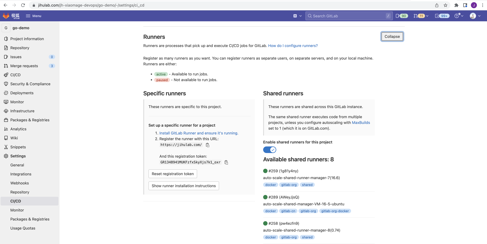

# DevOps工具鉴宝之极狐GitLab

全过程验证项目在 GitLab 中从初始化设置、计划、需求和代码管理、持续构建和扫描等全流程。


## 极狐GitLab 和 GitLab CE/EE


## 鉴宝剧本

模拟一个创业团队从零开始使用**极狐GitLab**的场景

### 前序准备
0. 注册极狐SaaS    
`https://jihulab.com/users/sign_up`

1. 登陆极狐SaaS    
`https://jihulab.com`

2. 设置语言环境（可选）    
**用户设置(User Setting) > 偏好设置(Preferences) > 本地化(Localization) > 语言(Language)**

3. 申请旗舰版试用    
**创建群组(Group) > 群组设置(Group Setting) > 计费(Billing) > 开始试用(Start Free Trail)**
> 此处创建的群组为根群组，根群组下面可以创建子群组或项目

## 计划阶段
### 群组和项目(Group and Project)
1. 创建名为`电商BU`的群组（Group）
2. 在`电商BU`群组下面创建两个子群组（Sub Group）
    - 支付团队
    - 订单团队
3. 在`订单团队`子群组下面分别创建项目
    - hello-order-service     
4. 在`支付团队`子群组下面分别创建项目
    - hello-pay-service  
> 项目的创建可以考虑使用项目模板(Project Template)，模板有内置的，同时也支持自定义

### 标签(Label)
> 本示例中创建的标签均在Group层级，Project层级也可以创建标签
1. 任务类型标签，用于标记任务的类型，如Feature,Bug,TechDebt等
2. 优先级标签，用于标记任务的优先级
3. 价值流标签，用于标记任务的状态

### 里程碑与迭代(Milestone and Iteration)
1. 创建两个`群组里程碑`，以每个月为一个里程碑，设置里程碑开始和结束的时间，类似部门级的里程碑规划
2. 基于时间创建迭代，创建4个迭代，模拟2周一个迭代，两个迭代一个里程碑的敏捷开发周期。

## 需求阶段
### 史诗与子史诗(Epics and Sub-Epics)
1. 回到`电商BU`群组，创建名为`B2B电商系统`的史诗，代表电商部门一个比较大的商业想法
2. 创建两个名为`订单功能`和`支付功能`的子史诗，代表商业想法的需求初步拆分

### 议题(Issues)
1. 在`hello-order-service`项目下创建名为`订单查询功能`的议题，代表一个用户故事
2. 关联议题到史诗、里程碑、迭代
3. 设置议题指派人、截止日期、预计投入时间、权重和标签等

### 路线图(Roadmap)
1. 为创建的史诗、子史诗和议题分别设定开始和结束时间，会自动生成产品的路线图

### 史诗看板(Epic Boards)
1. 在史诗看板中创建列表，并选择对应的标记
2. 将史诗和子史诗拖拽到对应的看板泳道中

### 议题看板(Issue Boards)
1. 在议题看板中创建列表，并选择对应的标记
2. 将议题拖拽到对应的看板泳道中

### 价值流分析
1. 回到`电商BU`群组 -> 分析(Analytics) -> 价值流(Value Stream Analytics) ->创建新的价值流(Create New Value Stream)
2. 不使用模板创建(Create from no template) -> 填入阶段名称-->选择开始和结束事件

## 开发阶段
### 推送规则(Push Rules)
推送规则可以在实例级、群组级和项目级进行配置，并批量向下继承，低层级的配置会覆盖高层级。以下以项目级为例：  
`hello-order-service`项目 -> 设置(Settings) -> 仓库(Repository) -> 推送规则(Push Rules)

- 设置一个提交信息的规则 `^\[(([a-z,A-Z]+))\]\s#(\d*)`
- 设置一个文件推送的规则 `(jar|exe)$`

### 受保护分支(Protected Branches)
受保护分支用于在分支层面更加细粒度的权限管理，仅允许指定的角色、组或用户对收到保护的分支进行推送(Push)和合并(Merge)  
`hello-order-service`项目 -> 设置(Settings) -> 仓库(Repository) -> 受保护分支(Protected branches)

### 审批规则(Merge Request Approval Rules)
审批规则定义在合并请求(Merge Request)在合并之前需要经过的审批配置。审批规则可以在实例级、项目级和合并请求级配置。以下以项目级为例：  
`hello-order-service`项目 -> 设置(Settings) -> 通用(General) -> 合并请求审批(Merge request approvals)

- 禁止MR提交人审批
- 指定MR的审批人

---
# 极狐GitLab Runner 介绍及使用

极狐GitLab Runner 是极狐GitLab 的重要组件，是实现 CI/CD 的“瑞士军刀”，具有安装简单、使用灵活的特点，而且支持多种 CPU 架构、多种 Linux 发行版以及多种 OS。

* 支持的 CPU 架构有：x86, AMD64, ARM64, ARM, s390x, ppc64le
* 支持的 Linux 发行版有：CentOS, Debian, Ubuntu, RHEL, Fedora, Mint
* 支持如下的 OS：Linux, Windows, macOS, FreeBSD

极狐GitLab Runner 的安装使用方式也很灵活，可以通过安装包安装，也可以用 docker 来运行，甚至都支持 Kubernetes。


## 极狐GitLab Runner 的多种安装和运行方式


- [用 k3s 来运行极狐GitLab Runner](https://about.gitlab.cn/blog/2022/02/03/k3s-runner/)
- [以 docker 的方式来运行极狐GitLab Runner](https://about.gitlab.cn/blog/2021/12/09/runner-docker/)
- [以 Kubernetes 的方式来运行极狐GitLab Runner](https://about.gitlab.cn/blog/2021/12/09/runner-k8s/)
- [用 Omnibus 来安装和运行极狐GitLab Runner](https://about.gitlab.cn/blog/2021/12/07/runner-ubuntu/)


## 用 docker 的方式来安装和运行极狐GitLab Runner

### 前提条件

* docker 环境

docker 的安装可以根据不同 OS 在[docker 官网上](https://docs.docker.com/engine/install/ubuntu/)找到对应的安装方式，本次分享以在 Ubuntu 20.04 上安装 docker 为例来讲述。执行如下命令即可完成安装：

```
$ apt-get update
$ apt-get install \
    ca-certificates \
    curl \
    gnupg \
    lsb-release
$ curl -fsSL https://download.docker.com/linux/ubuntu/gpg | sudo gpg --dearmor -o /usr/share/keyrings/docker-archive-keyring.gpg
$ echo \
  "deb [arch=$(dpkg --print-architecture) signed-by=/usr/share/keyrings/docker-archive-keyring.gpg] https://download.docker.com/linux/ubuntu \
  $(lsb_release -cs) stable" | sudo tee /etc/apt/sources.list.d/docker.list > /dev/null

$ apt-get update && apt-get install docker-ce docker-ce-cli containerd.io docker-compose-plugin
```

* 极狐GitLab SaaS 账号

* Runner Token

可以通过 Project --> Settings --> CI/CD --> Runners（中文对应项目 --> 设置 --> CI/CD --> Runners）找到：




### Runner 安装

执行如下命令启动一个 Runner 容器：

```
$ docker run -d --name jh-gitlab-runner-docker --restart always -v $PWD:/etc/gitlab-runner -v /var/run/docker.sock:/var/run/docker.sock gitlab/gitlab-runner:latest
```
然后进入启动的容器内并进行 Runner 的注册：

```
$ docker exec -it jh-gitlab-runner-docker sh
gitlab-runner register
Runtime platform                                    arch=amd64 os=linux pid=38 revision=c6bb62f6 version=14.10.0
Running in system-mode.

Enter the GitLab instance URL (for example, https://gitlab.com/):
https://jihulab.com
Enter the registration token:
GR1348941MUKFzfxSkyXjs7k1_oxr
Enter a description for the runner:
[07530386ce76]: devops community and jh
Enter tags for the runner (comma-separated):
devops,jh,community
Enter optional maintenance note for the runner:
xiaomage
Registering runner... succeeded                     runner=GR1348941MUKFzfxS
Enter an executor: docker, parallels, docker+machine, docker-ssh+machine, custom, shell, ssh, virtualbox, kubernetes, docker-ssh:
docker
Enter the default Docker image (for example, ruby:2.7):
docker:20.10.7-dind
Runner registered successfully. Feel free to start it, but if it's running already the config should be automatically reloaded!
```

上面是通过 `register` 这个命令来根据注册一步步完成注册，也可以直接将需要的参数全部传入来完成注册，如下所示：

```
$ gitlab-runner register -n \
  --url https://jihulab.com/ \
  --registration-token GR1348941MUKFzfxSkyXjs7k1_oxr \
  --executor docker \
  --description "devops community and jihu gitlab" \
  --tag-list "devops,jihu,gitlab" \
  --docker-image "docker:20.10.7-dind" \
  --docker-volumes /var/run/docker.sock:/var/run/docker.sock
```

注册成功，可以在极狐GitLab Runner 界面看到：


## Runner 的使用

下面讲述使用自建 Runner 来构建 CI/CD 的过程。

### 前提条件

* 一个用于构建 CI/CD 的项目。

Demo 项目也托管在极狐GitLab SaaS 上，地址为：https://jihulab.com/jh-xiaomage-devops/go-demo。


### 运行 CI/CD

在代码根目录中添加一个 `.gitlab-ci.yml` 文件，内容如下：


```
services:
  - docker:20.10.7-dind

stages:
  - build

build:
  tags:
    - devops
  stage: build
  script:
    - docker login -u "$CI_REGISTRY_USER" -p "$CI_REGISTRY_PASSWORD" $CI_REGISTRY
    - docker build -t $CI_REGISTRY_IMAGE:v1.0.0 .
    - docker push $CI_REGISTRY_IMAGE:v1.0.0
```

可以在 CI/CD Pipeline 中看到构建结果：


以及构建日志，而且在构建日志中可以看到使用的是 self-host 的runner 而非极狐GitLab SaaS 默认的 runner 完成的整个构建：


